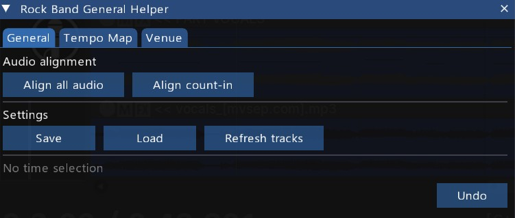
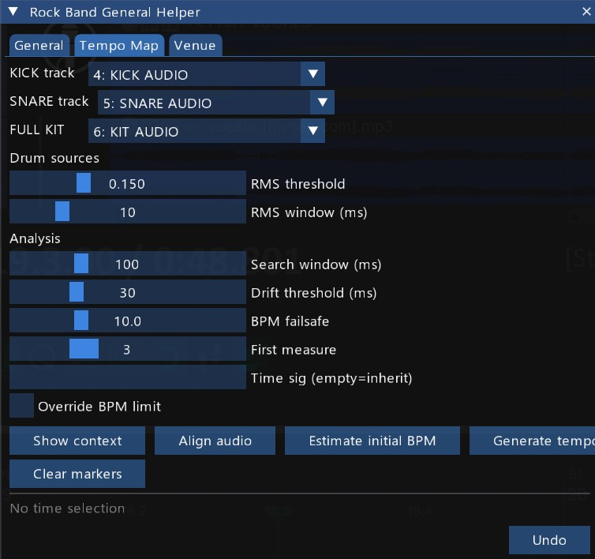
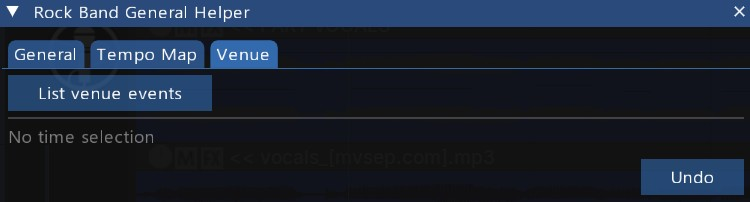

# Rock Band General Helper

← [Back to overview and installation](../README.md)

**Utility actions for custom song authoring in REAPER.** A REAPER ReaScript that provides three main tool sets: general audio alignment utilities, audio-driven tempo map generation from a drum stem, and VENUE track validation for Rock Band authoring.

---

## Quick start

1. Open a REAPER project with your drum stems already imported.
2. Run the script. The window opens and attempts to auto-select the KICK, SNARE, KIT, and Fallback tracks by name.
3. Confirm the track selections in the Tempo Map tab dropdowns if needed.
4. Click **Estimate initial BPM** to verify the detected tempo before writing anything.
5. Click **Generate tempo map** to write REAPER tempo markers derived from the drum onsets.

---

## UI overview

The window is organized into three tabs plus a status panel at the bottom.

| Tab           | Purpose                                                                            |
| ------------- | ---------------------------------------------------------------------------------- |
| **General**   | Audio alignment utilities (align all audio, count-in clips) and settings save/load |
| **Tempo Map** | Detect BPM from drum audio and generate REAPER tempo markers measure-by-measure    |
| **Venue**     | Validate and list all text events on the VENUE track                               |

The bottom of the window always shows the active time selection (or "No time selection") and the result panel from the last action.

---

## General tab

### Audio alignment

#### Align all audio

Moves every single-item audio track in the project to start at the same position as the **SONG AUDIO** track. Useful when drum and instrument stems were exported separately and landed at different positions.

- Tracks with zero audio items (MIDI tracks, empty tracks) are silently skipped.
- Tracks with multiple audio items are skipped and listed in the result.
- **COUNT IN** is always excluded — use **Align count-in** for that track.
- Fully undoable.

#### Align count-in

Positions **COUNT IN** clips at the standard count-in beat slots derived from the project's root tempo marker time signature:

| Time sig   | Slots                                         |
| ---------- | --------------------------------------------- |
| 4/4        | m1 beats 1, 3 → m2 beats 1, 2, 3, 4 (6 clips) |
| 3/4        | m1 beat 1 → m2 beats 1, 2, 3 (4 clips)        |
| Other even | m1 beat 1 + midpoint → m2 all beats           |

Clips beyond the 6-slot cap are left untouched and listed in the result. Fully undoable.

### Settings

**Save** writes the current slider values to the project using REAPER's project state. **Load** restores them. Settings are loaded automatically when the script opens (if a save exists) and when you switch REAPER project tabs.

**What is saved:** all Tempo Map sliders and the override checkbox.

**What is not saved:** track selections. The script re-detects KICK, SNARE, KIT, and Fallback tracks by name on each open and project switch.

---

## Tempo Map

### Overview

The Tempo Map section generates REAPER tempo markers from the actual timing of drum hits in your audio stem. Instead of entering BPM by hand and hoping it tracks a live recording, the script measures the real downbeat positions and places markers only where the tempo drifts enough to matter.

The typical workflow:

1. Import your drum audio stem (kick, snare, kit mix, or another instrument track).
2. Align the audio so the first true downbeat lands at the configured start measure (default: measure 3).
3. Run **Estimate initial BPM** to verify the detected tempo.
4. Run **Generate tempo map** to write the markers.
5. Use **Clear generated markers** between test runs to start fresh.

### Track selection

| Dropdown        | Track it expects               | Role                                                    |
| --------------- | ------------------------------ | ------------------------------------------------------- |
| **KICK track**  | `KICK AUDIO`                   | Primary onset source — kick has the sharpest transient  |
| **SNARE track** | `SNARE AUDIO`                  | Used per-window when kick has no onset above threshold  |
| **KIT track**   | `KIT AUDIO`                    | Fallback when both kick and snare are quiet in a window |
| **Fallback**    | `GUITAR AUDIO` or `KEYS AUDIO` | Last resort when all drum sources are quiet             |

The script uses **per-window priority**: for each measure window it tries kick first, then snare, then kit, then the fallback track. The highest-priority source that has a detectable onset in that window is used for that measure. This allows the generator to track the beat through intros, transitions, and quiet passages where kick or snare may be absent.

The script auto-selects tracks by name on startup and on project switch. Change the dropdowns manually if your tracks use different names.

### Actions

#### Show context

Reads the tempo marker that applies at the time-selection start (or project start if no selection active) and displays the BPM, time signature, and the calculated start time of the first generated measure.

Use this before generating to confirm that the project's existing tempo marker and the **First measure** slider are configured correctly.

#### Align audio

Moves the audio item on each selected drum track so it starts at the same position as the item on the **SONG AUDIO** track.

- Tracks with multiple items are skipped with a warning.
- Tracks already at the correct position are reported without changes.
- Fully undoable.

Use this when your drum stems were exported separately from the full mix and landed at slightly different positions.

#### Estimate initial BPM

Runs onset detection on the drum audio and estimates the average BPM and likely time signature for the analysis range. Read-only — nothing is written to the project.

The result panel shows:

- Detected BPM (and an alternate ×2/÷2 reading)
- Estimated time signature
- Onset count and confidence
- A warning if the estimated BPM differs significantly from the project's current tempo marker (which would cause measure-boundary scanning to use wrong windows)

> **Tip:** Run this first, then apply the estimated BPM to the project's root tempo marker before running Generate. The generator's beat-grid propagation works best when the project BPM is already close to the true song tempo.

#### Generate tempo map

Generates REAPER tempo markers from the drum audio. The algorithm:

1. Anchors on the configured first measure (or the time-selection start).
2. Propagates a beat grid forward measure-by-measure, searching for a drum onset near each expected downbeat.
3. Inserts a new tempo marker **only** where the detected downbeat deviates from the expected position by more than the drift threshold.
4. Stops with a warning if the implied BPM between two consecutive detections drifts beyond the failsafe limit.

Re-running over the same range is safe — existing markers in the range are cleared before insertion, so you always get a clean result.

Respects time selection: if a selection is active, only the measures within it are processed.

#### Clear generated markers

Deletes all REAPER tempo markers except the root marker at index 0 (the one REAPER always preserves). Use this to reset between test runs. Fully undoable.

### Sliders

| Slider                       | Range       | Default | What it does                                                                                                                  |
| ---------------------------- | ----------- | ------- | ----------------------------------------------------------------------------------------------------------------------------- |
| **RMS threshold**            | 0.001 – 0.5 | 0.15    | Audio level above which a drum hit is detected. Lower = more sensitive; raise to ignore ghost notes and quiet pedal hits.     |
| **RMS window (ms)**          | 5 – 30 ms   | 10 ms   | Analysis resolution. Short windows give sharp onset times for percussive sounds — rarely needs changing.                      |
| **Search window (ms)**       | 20 – 300 ms | 100 ms  | How far either side of the expected downbeat to search for an onset. Wider = more tolerant of tempo drift in live recordings. |
| **Drift threshold (ms)**     | 5 – 100 ms  | 30 ms   | Minimum deviation before a new marker is inserted. Higher = fewer, sparser markers; lower = finer-grained correction.         |
| **BPM failsafe**             | 2 – 30 BPM  | 10 BPM  | Generation stops if the implied BPM between two detected downbeats drifts more than this from the initial estimate.           |
| **First measure**            | 1 – 8       | 3       | The project measure where the beat-grid anchor is placed. Align your drum audio so the first true downbeat lands here.        |
| **Time sig num (0=inherit)** | 0 – 12      | 0       | Time signature numerator override. 0 = read from the project's existing tempo marker. Set to 3 for 3/4, 4 for 4/4, etc.       |

**Override BPM limit** — checkbox that bypasses the failsafe entirely. Use for songs with intentional large tempo swings.

> **Tip:** All sliders support Ctrl+click to type an exact value.

---

## Venue

### What it does

**List venue events** reads the VENUE track (found by name) and audits all MIDI text events against the Rock Band Network specification. It reports:

- **Unknown events** — text events not in the RBN spec. These will cause issues at compile time.
- **Consecutive camera repeats** — the same directed or coop camera cut used back to back.
- **Directed cut spacing** — directed cuts that are too close together (directed cuts require a minimum gap between them per RBN guidelines).
- **Event frequency count** — how many times each event is used across the whole track, sorted by frequency.

### Track naming

The script looks for a track named `VENUE` (case-insensitive). No dropdown is needed — it finds the track automatically.

### Validated event categories

The VENUE spec includes three categories of events:

| Category            | Examples                                                           |
| ------------------- | ------------------------------------------------------------------ |
| **Camera cuts**     | `[coop_all_near]`, `[directed_drums]`, `[directed_vocals_cls]`, …  |
| **Post-processing** | `[bloom.pp]`, `[film_b+w.pp]`, `[video_trails.pp]`, …              |
| **Lighting**        | `[lighting (verse)]`, `[lighting (frenzy)]`, `[lighting (bre)]`, … |

---

## Tips

- **Estimate BPM first, apply it to the project root marker, then generate.** If the project BPM is far off from the actual song tempo, the measure-boundary scan inside Estimate initial BPM covers the wrong time windows. Get the BPM roughly right first and re-run.
- **Use a time selection for tricky sections.** A selection over a known drum passage avoids measure-boundary scan issues entirely and lets you verify one section before processing the whole song.
- **Raise the drift threshold to get a sparser map.** For a tight studio recording, 50–80 ms still catches audible drift without inserting markers every measure. For a loose live recording, drop to 10–20 ms for measure-by-measure correction.
- **Use Clear generated markers between test runs** rather than manually undoing. It removes everything in one click and keeps the root marker intact.
- **Name your drum stems `KICK AUDIO`, `SNARE AUDIO`, `KIT AUDIO`, and `GUITAR AUDIO` (or `KEYS AUDIO`).** Auto-detection runs on those names every time the script opens, saving you the dropdown step entirely.
- **Verify with Show context before generating.** It tells you exactly what BPM and time sig the generator will use as its starting point, and confirms the first-measure anchor time is what you expect.
- **The per-window fallback picks up where kick and snare drop out.** If your song has a quiet intro or a breakdown with no kick, set up the KIT or Fallback track — the generator will switch to it automatically for windows where the primary sources have no onset.

---

## Troubleshooting

### Tempo Map

**Estimate initial BPM returns the wrong tempo (e.g. half or double).**
Check the "Alt. BPM" line in the result panel — if the alternate is closer to the true tempo, the histogram found a harmonic instead of the fundamental. The project BPM may be far from the actual song tempo, pulling the scan window to the wrong part of the audio. Apply the Alt. BPM to the project's root tempo marker and re-run.

**No onsets found.**
The RMS threshold may be too high, or the analysis window lands in a quiet section (intro with no drums). Lower the threshold, make a time selection over a section with audible drum hits, or set up the KIT or Fallback track to cover quiet passages.

**Generated markers are placed at the wrong beat (beat 2, 3, or 4 instead of beat 1).**
This usually means the anchor snapped to the wrong onset. Verify with **Show context** that the calculated first-measure start time actually falls on a downbeat. If the project BPM is significantly off, the measure boundary used as the anchor search center will be wrong. Correct the project BPM first.

**Generation stops immediately with a failsafe warning.**
The implied BPM between the first two detected downbeats is outside the failsafe range. Either the onset detection is snapping to the wrong beat, or the song has an intentionally large initial tempo change. Check the RMS threshold and search window, or enable **Override BPM limit** if the large swing is intentional.

**All generated BPM values are correct but about half or one-third of the expected value.**
This was a bug where several consecutive on-time measures preceded the first marker insert, and the BPM formula incorrectly assumed a 1-measure span. Fixed in the current version.

### Venue

**List venue events reports no events.**
Confirm a track named `VENUE` exists in the project. The track must have MIDI items with text events — audio items are ignored.

**Unknown events are listed but the event names look correct.**
Check for typos, extra spaces, or wrong bracket style. The validator does an exact string match against the RBN spec list.

---

## Known limitations

1. **Tempo map generation freezes the UI during audio analysis.** Single-threaded Lua; REAPER's audio accessor APIs do not work reliably from a Lua coroutine. Typical song sections finish in a few seconds.

2. **Only one audio item per drum track is analysed.** If the stem is split across multiple items, glue them first.

3. **Time signature detection is a heuristic.** Always verify for unusual time signatures. The override slider lets you force the correct numerator.

4. **Large project BPM mismatch can affect Estimate initial BPM accuracy.** The BPM calculation itself is IOI-based (unaffected by project tempo), but the local scan window uses project measure boundaries. At very large mismatches the scan window may cover the wrong part of the song. Using a time selection avoids this entirely.
