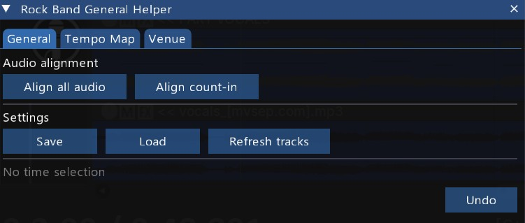
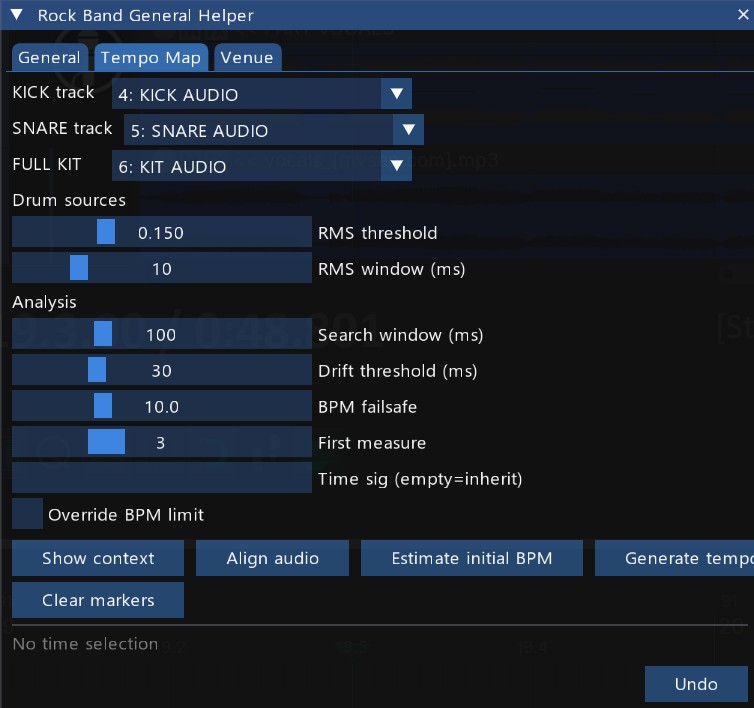
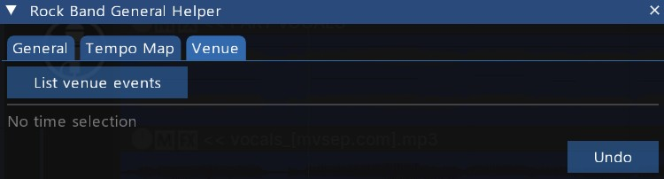

# Rock Band General Helper

← [Back to overview and installation](../README.md)

**Utility actions for custom song authoring in REAPER.** A REAPER ReaScript covering audio alignment, audio-driven tempo map generation, MIDI conversion for drums, keys, and guitar, difficulty validation, tab-input reference guides, MIDI alignment/pattern tools, and VENUE/EVENTS track generation, spread across five always-visible tabs plus four work-in-progress tabs.

---

## Quick start

1. Open a REAPER project with your drum stems already imported.
2. Run the script. The window opens with five tabs: **General | Difficulty | Tab Input | MIDI | Venue**.
3. The Tempo Map / Drums / Keys / Guitar tabs are hidden by default (see [WIP tabs](#wip-tabs) below) — turn on **Show WIPs?** in General → Settings to reach them.
4. With WIPs on, confirm the track selections in the Tempo Map tab dropdowns if needed.
5. Click **Estimate initial BPM** to verify the detected tempo before writing anything.
6. Click **Generate tempo map** to write REAPER tempo markers derived from the drum onsets.

---

## UI overview

The window is organized into tabs plus a status panel at the bottom. Five tabs are always visible; four more (Tempo Map, Drums, Keys, Guitar) are work-in-progress and hidden until enabled.

| Tab            | Purpose                                                                              |
| -------------- | ------------------------------------------------------------------------------------ |
| **General**    | Audio alignment, song fade out, settings save/load, and a workflow checklist        |
| **Difficulty** | Validate Pro Keys and 5-Lane Keys tracks at each difficulty level                   |
| **Tab Input**  | Reference guide: parse ASCII tab notation for Guitar/Bass, Keys/Pro Keys, or Vocal  |
| **MIDI**       | Align, length-sync, or find-and-replace patterns on MIDI items                      |
| **Venue**      | Validate and generate text events on the VENUE and EVENTS tracks                    |

| WIP tab (hidden by default) | Purpose                                                            |
| ---------------------------- | ------------------------------------------------------------------ |
| **Tempo Map**                | Detect BPM from drum audio and generate REAPER tempo markers measure-by-measure |
| **Drums**                    | Convert GM MIDI drum notes to Rock Band 5-lane format               |
| **Keys**                     | Convert piano MIDI to Rock Band Pro Keys, 5-Lane Keys, or split into hand tracks |
| **Guitar**                   | Convert raw guitar MIDI pitches to Rock Band Expert gem notes       |

These four function at a basic level but have known issues and aren't ready for general use. Enable them via **Show WIPs? = Yes** in General → Settings; they appear after Venue in the tab bar.

The bottom of the window always shows the active time selection (or "No time selection") and the result panel from the last action.

---

## General tab

Contains three sub-tabs: **Actions**, **Settings**, and **Workflow**.

### Actions sub-tab

#### Refresh tracks

Re-scans the project's track list to pick up any tracks added or renamed after the script opened.

#### Audio alignment

##### Align all audio

Moves every single-item audio track in the project to start at the same position as the **SONG AUDIO** track. Useful when drum and instrument stems were exported separately and landed at different positions.

- Tracks with zero audio items (MIDI tracks, empty tracks) are silently skipped.
- Tracks with multiple audio items are skipped and listed in the result.
- **COUNT IN** is always excluded — use **Align count-in** for that track.
- Fully undoable.

##### Align count-in

Positions **COUNT IN** clips at the standard count-in beat slots derived from the project's root tempo marker time signature:

| Time sig   | Slots                                         |
| ---------- | --------------------------------------------- |
| 4/4        | m1 beats 1, 3 → m2 beats 1, 2, 3, 4 (6 clips) |
| 3/4        | m1 beat 1 → m2 beats 1, 2, 3 (4 clips)        |
| Other even | m1 beat 1 + midpoint → m2 all beats           |

Clips beyond the 6-slot cap are left untouched and listed in the result. Fully undoable.

#### Song fade out

**Fade out** creates a volume fade on the **SONG AUDIO** track (not the master track) spanning the current time selection — a time selection is required. The fade starts at the track's existing volume level at the selection start and reaches silence at the selection end. Any existing envelope points inside the selection are replaced; points outside it are untouched. Fully undoable.

The result panel adds a heads-up if the selected range looks unusual for a game fade out: under 2 seconds ("likely to sound like a cut"), 5–8 seconds ("on the longer side"), or over 8 seconds ("quite long"). Pick a range that starts at a musically meaningful point (e.g. the end of the last vocal phrase) for the most natural-sounding cutoff.

### Settings sub-tab

**Venue preview** — the default preview size (1×/2×) and sprite display mode (Animated/Still), shared with the Venue → Preview sub-tab and the standalone Venue Preview window (see [below](#standalone-venue-preview)).

**Show WIPs?** — toggles whether the Tempo Map, Drums, Keys, and Guitar tabs appear (see [WIP tabs](#wip-tabs)). Default No.

**Save** writes the current slider values to the project using REAPER's project state. **Load** restores them. Settings are loaded automatically when the script opens (if a save exists) and when you switch REAPER project tabs.

**What is saved:** all Tempo Map sliders and the override checkbox.

**What is not saved:** track selections. The script re-detects KICK, SNARE, KIT, and Fallback tracks by name on each open and project switch.

### Workflow sub-tab

A per-project authoring checklist: a list of steps, grouped into sections, that you check off as you finish them — handy for picking up where you left off after a break, or when juggling several songs at once. The checklist comes from a plain-text template file, so you can tailor the list of steps to how you actually work (e.g. a shorter checklist for an instrumental song with no vocals).

#### Choosing a template

**Workflow** combo — pick a `.txt` file from `resources/workflow/`. The script ships with one starter template, `Default.txt`, covering a typical full-band song end to end. If the folder has no `.txt` files, the tab shows a disabled hint instead. If your saved project doesn't have a template selected yet (first use, or the file it had selected was deleted), a template literally named `Default` is picked automatically; if there's no `Default`, the first template alphabetically is used instead.

**Show completion timestamp** — checkbox, off by default. When on, a checked item shows "Completed on dd.MM.yyyy at hh:mm" underneath it. The timestamp is recorded the moment you check an item either way — this checkbox only controls whether it's displayed.

#### Checking off items

Click the checkbox or the item's label text to toggle it — both work. Checking an item saves immediately to the project (its own save slot, independent of this tab's own Save/Load buttons below), so you don't need to remember to hit Save before closing REAPER. Unchecking an item clears its recorded time.

Checked state is tracked per **section + item**, not by the item's text alone — so if two different sections both have a step called "Guitar" (as the starter template does, under both "Instruments Expert" and "Difficulty reductions"), checking one doesn't check the other.

If you switch to a different template, any step whose section heading *and* step text match exactly what you had checked before carries its checked state and timestamp over. Anything reworded, moved to a different section, or new to the template starts unchecked — you decide whether to re-check it.

#### Writing your own template

A template is a plain `.txt` file in `resources/workflow/`, one entry per line:

| Line looks like            | Becomes                                                                 |
| --------------------------- | ------------------------------------------------------------------------ |
| `[Section Name]`            | A section heading — not checkable, just groups the steps under it.      |
| `Some step`                 | A checkable step.                                                        |
| `Some step {a hint}`        | A checkable step with a hover tooltip ("a hint"), stripped from the label. |
| `{a hint}` on its own line  | Attaches as the tooltip to the step on the line right above it.         |

Copy `Default.txt` as a starting point and rename/reorder/add/remove lines freely — the checklist rebuilds from whatever's in the file the next time you select it.

A couple of edge cases are handled predictably rather than guessed at:

- If a step somehow ends up with more than one tooltip attached (e.g. it already has a same-line `{...}` *and* a `{...}` line follows it, or it has two `{...}` groups on the same line), the tooltip is dropped rather than picking one arbitrarily.
- The tab warns you (above the checklist) if a template file has the same step repeated twice under the same section — almost always a copy-paste slip — or if its `[` / `]` or `{` / `}` brackets don't balance, which usually means a bracket got deleted or mistyped somewhere in the file. Both are just warnings; the rest of the file still loads.

Checked-item history is capped at roughly 100 entries across everything you've ever checked in a project; if you're well past that, the next time you check something the script quietly drops any entries that no longer match a step in *any* template currently in `resources/workflow/`, so leftover checkmarks from templates you've since edited or removed don't pile up forever.

---

## Tempo Map

### Overview

The Tempo Map section generates REAPER tempo markers from the actual timing of drum hits in your audio stem. Instead of entering BPM by hand and hoping it tracks a live recording, the script measures the real downbeat positions and places markers only where the tempo drifts enough to matter.

The typical workflow:

1. Import your drum audio stem (kick, snare, kit mix, or another instrument track).
2. Align the audio so the first true downbeat lands at the configured start measure (default: measure 3).
3. Run **Estimate initial BPM** to verify the detected tempo.
4. Run **Generate tempo map** to write the markers.
5. Use **Clear generated markers** between test runs to start fresh.

### Track selection

| Dropdown        | Track it expects               | Role                                                    |
| --------------- | ------------------------------ | ------------------------------------------------------- |
| **KICK track**  | `KICK AUDIO`                   | Primary onset source — kick has the sharpest transient  |
| **SNARE track** | `SNARE AUDIO`                  | Used per-window when kick has no onset above threshold  |
| **KIT track**   | `KIT AUDIO`                    | Fallback when both kick and snare are quiet in a window |
| **Fallback**    | `GUITAR AUDIO` or `KEYS AUDIO` | Last resort when all drum sources are quiet             |

The script uses **per-window priority**: for each measure window it tries kick first, then snare, then kit, then the fallback track. The highest-priority source that has a detectable onset in that window is used for that measure. This allows the generator to track the beat through intros, transitions, and quiet passages where kick or snare may be absent.

The script auto-selects tracks by name on startup and on project switch. Change the dropdowns manually if your tracks use different names.

### Actions

#### Show context

Reads the tempo marker that applies at the time-selection start (or project start if no selection active) and displays the BPM, time signature, and the calculated start time of the first generated measure.

Use this before generating to confirm that the project's existing tempo marker and the **First measure** slider are configured correctly.

#### Align audio

Moves the audio item on each selected drum track so it starts at the same position as the item on the **SONG AUDIO** track.

- Tracks with multiple items are skipped with a warning.
- Tracks already at the correct position are reported without changes.
- Fully undoable.

Use this when your drum stems were exported separately from the full mix and landed at slightly different positions.

#### Estimate initial BPM

Runs onset detection on the drum audio and estimates the average BPM and likely time signature for the analysis range. Read-only — nothing is written to the project.

The result panel shows:

- Detected BPM (and an alternate ×2/÷2 reading)
- Estimated time signature
- Onset count and confidence
- A warning if the estimated BPM differs significantly from the project's current tempo marker (which would cause measure-boundary scanning to use wrong windows)

> **Tip:** Run this first, then apply the estimated BPM to the project's root tempo marker before running Generate. The generator's beat-grid propagation works best when the project BPM is already close to the true song tempo.

#### Generate tempo map

Generates REAPER tempo markers from the drum audio. The algorithm:

1. Anchors on the configured first measure (or the time-selection start).
2. Propagates a beat grid forward measure-by-measure, searching for a drum onset near each expected downbeat.
3. Inserts a new tempo marker **only** where the detected downbeat deviates from the expected position by more than the drift threshold.
4. Stops with a warning if the implied BPM between two consecutive detections drifts beyond the failsafe limit.

Re-running over the same range is safe — existing markers in the range are cleared before insertion, so you always get a clean result.

Respects time selection: if a selection is active, only the measures within it are processed.

#### Clear generated markers

Removes auto-generated tempo markers. If a time selection is active, only markers within the selection are deleted; otherwise all markers except the root marker at index 0 are removed. Use this to reset between test runs. Fully undoable.

### Sliders

| Slider                       | Range       | Default | What it does                                                                                                                  |
| ---------------------------- | ----------- | ------- | ----------------------------------------------------------------------------------------------------------------------------- |
| **RMS threshold**            | 0.001 – 0.5 | 0.15    | Audio level above which a drum hit is detected. Lower = more sensitive; raise to ignore ghost notes and quiet pedal hits.     |
| **RMS window (ms)**          | 5 – 30 ms   | 10 ms   | Analysis resolution. Short windows give sharp onset times for percussive sounds — rarely needs changing.                      |
| **Search window (ms)**       | 20 – 300 ms | 100 ms  | How far either side of the expected downbeat to search for an onset. Wider = more tolerant of tempo drift in live recordings. |
| **Drift threshold (ms)**     | 5 – 100 ms  | 30 ms   | Minimum deviation before a new marker is inserted. Higher = fewer, sparser markers; lower = finer-grained correction.         |
| **BPM failsafe**             | 2 – 30 BPM  | 10 BPM  | Generation stops if the implied BPM between two detected downbeats drifts more than this from the initial estimate.           |
| **First measure**            | 1 – 8       | 3       | The project measure where the beat-grid anchor is placed. Align your drum audio so the first true downbeat lands here.        |
| **Time sig num (0=inherit)** | 0 – 12      | 0       | Time signature numerator override. 0 = read from the project's existing tempo marker. Set to 3 for 3/4, 4 for 4/4, etc.       |

**Override BPM limit** — checkbox that bypasses the failsafe entirely. Use for songs with intentional large tempo swings.

> **Tip:** All sliders support Ctrl+click to type an exact value.

---

## Drums tab

Converts General MIDI drum notes to Rock Band 5-lane format and writes them to the target track.

### Track selection

| Dropdown           | What it expects                                          |
| ------------------ | -------------------------------------------------------- |
| **Source track**   | A MIDI track with GM drum notes (e.g. Guitar Pro export) |
| **Target track**   | The `PART DRUMS` MIDI track to write into                |

### Options

- **Ghost note threshold** — MIDI velocity at or below which a note is skipped. Raise to filter out ghost notes or light pedal hits.
- **Crash lane** — assigns crash cymbal notes to Yellow (default) or Green lane.
- **Pro Drums** — when enabled, inserts cymbal marker notes (110/111/112) alongside the gem notes, enabling Pro Drums mode in-game.

### Actions

- **Preview** — runs the conversion and displays the result mapping without writing any notes.
- **Convert drums** — writes Rock Band drum notes into the target track. Any existing drum notes in the time selection (or whole item if no selection) are cleared first. Fully undoable.

---

## Keys tab

Contains four conversion tools for piano MIDI → Rock Band keys formats. Each tool has its own source and target track selectors.

### Hand Split

Splits a piano track into separate right-hand and left-hand MIDI tracks.

- Split by **MIDI channel** (Guitar Pro: ch1 = RH, ch2 = LH) or by **pitch threshold**.
- Set the right-hand target and left-hand target tracks independently — they can be different PART REAL_KEYS tracks.

### Convert to Pro Keys

Octave-shifts all notes into the C2–C4 range (MIDI 48–72) required for Pro Keys Expert authoring. Optionally inserts lane range shift markers where the pitch window moves.

### Pro Keys Animation

Copies notes in the C2–C4 range from a Pro Keys Expert source track to the animation target tracks. The animation tracks drive the on-screen keyboard highlight during gameplay.

### 5-Lane Keys

Maps a piano melody to Expert 5-Lane Keys gem pitches (96–100) using a sliding 5-semitone window. The window adapts measure-by-measure, so chords wider than 5 semitones are still mapped without collision. Phrase reset markers are inserted where the window resets to the lowest position.

All actions respect time selection.

---

## Guitar tab

Converts raw guitar MIDI pitches to Rock Band Expert Guitar gem notes (pitches 96–100) and optionally validates existing notes against RBN authoring rules.

### Track selection

| Dropdown           | What it expects                                                         |
| ------------------ | ----------------------------------------------------------------------- |
| **Source track**   | A MIDI track with raw guitar pitches (e.g. Guitar Pro MIDI export)      |
| **Target track**   | The `PART GUITAR` MIDI track to write into                              |

### Conversion options

- **Wrap gap (ms)** — rest gap that resets the gem-assignment window back to Green (position 0). Shorter = more frequent resets for songs with many breaks.
- **Context window (measures)** — how many measures ahead the gem-scale planner looks. Wider = smoother transitions; narrower = adapts more quickly to large pitch jumps.
- **Max chord** — maximum simultaneous gems per chord event (2 or 3).

### Actions

- **Preview** — shows a detailed per-note reasoning report without writing anything.
- **Convert guitar** — writes Rock Band gem notes into the target track. Existing gems in the range are cleared first. Fully undoable.
- **Validate guitar** — checks existing gems on the target track against RBN authoring rules (chord density, sustain gaps, illegal combinations). Reports violations with measure positions.

---

## Difficulty tab

Contains two sub-tabs for difficulty reduction guidance and validation.

### Pro Keys sub-tab

Analyzes PART REAL_KEYS_X/H/M/E tracks (auto-detected by name from the project).

- **Suggest Hard / Medium / Easy** — read-only report of what changes are needed to meet RBN density and chord rules at that difficulty.
- **Validate Expert / Hard / Medium / Easy / All** — checks chord count and span, interval jumps, spacing (Medium/Easy), and lane range markers against RBN Pro Keys rules. Only notes in the playable C2–C4 range are validated; overdrive, glissando, and trill markers are ignored.

### 5-Lane Keys sub-tab

Analyzes PART KEYS, which carries all four difficulties in separate pitch ranges:

| Difficulty | Pitch range |
| ---------- | ----------- |
| Expert     | 96–100      |
| Hard       | 84–88       |
| Medium     | 72–75       |
| Easy       | 60–62       |

- **Suggest Hard / Medium / Easy** — read-only report of required changes from Expert.
- **Validate Expert / Hard / Medium / Easy / All** — checks chord count, spacing, note length, and sustain gaps.

All actions respect time selection.

---

## Tab Input tab

A **reference guide, not a converter** — every mode here parses ASCII tab text and reports the resulting gem/pitch assignment in the result panel. Nothing is ever written to the project. Use the Guitar, Keys, or Drums tabs (or hand-authoring) to actually write notes; use Tab Input to plan chord shapes and check range/spacing before you do.

Three sub-tabs — **Guitar / Bass**, **Keys / Pro Keys**, **Vocal** — share the same input area:

### Accepted formats

- **Horizontal tab** — one line per event, six space-separated tokens (fret number or `-`), left = highest string down to right = lowest. Multi-digit frets are supported; a blank line marks a phrase break.
- **Vertical tab** — six rows (one per string), space-separated tokens per row, columns read left-to-right as events; an all-dash column marks a phrase break.

**Add note** appends an empty slot to the input (an all-dash line/column) — it doesn't touch the project either.

### Guitar / Bass

An extra **"Notes are in play order"** checkbox: checked assigns gems using ordered chord-shape ranking (aware of the previous shot); unchecked ("palette mode") just sorts the distinct pitches used and spreads them across gems 0–4 with no ordering context. **Run guide** reports the per-event gem assignment and reasoning, using the same Wrap gap / Max chord settings as the Guitar tab's converter.

### Keys / Pro Keys

An extra **"For animation (full C2–C4, no lane windows)"** checkbox: off scores against a 10th-wide Pro Keys lane window and suggests the best lane range; on scores against the full C2–C4 range instead (for planning `PART KEYS_ANIM_RH/LH` notes). **Run guide** finds the best octave shift to fit the notes into C2–C4 (MIDI 48–72), lists anything still out of range, and flags chords wider than the 12-semitone Expert max.

### Vocal

**Run guide** finds the best octave shift to fit the notes into the wider C1–C5 vocal range (MIDI 36–84), lists anything still out of range, and flags overly wide chords. Blank lines separate phrases.

---

## MIDI tab

Three sub-tabs: **Alignment**, **Length**, and **Pattern**.

### Alignment sub-tab

Aligns a single imported MIDI item to the project grid.

#### Modes

- **Move only** — shifts the item so its first note lands at the time selection start. Useful for rough alignment when tempo is known.
- **Move + Stretch** — also adjusts the take playback rate so the last note aligns with the time selection end. Use this when the MIDI was recorded at a slightly different tempo and needs to stretch to fit the project grid.

#### Workflow

1. Set a time selection over the target range.
2. Select the source track in the dropdown.
3. Click **Align MIDI**.

The result panel reports the shift amount in milliseconds and, when stretching, the playback rate change. Fully undoable.

### Length sub-tab

Resizes MIDI items to match a reference track's length — useful after aligning several imported MIDI tracks whose items ended up different lengths.

1. Select the **Reference track** — the MIDI track already sized to the full song length.
2. Click **Resize all MIDI**.

For every other track, the first MIDI item is resized (its right edge moved) to match the reference item's length exactly — notes are never moved or deleted. Items that don't start at project position 0 are skipped and reported (those are Alignment's job, not Length's). Fully undoable; the result warns if any item was shrunk, so you can verify no notes were cut off.

### Pattern sub-tab

Finds and replaces a recurring note pattern across a MIDI track, or tiles a pattern across a range.

1. Select the **Source track**.
2. Make a time selection over an example of the pattern you want to search for, then click **Set Search** to capture it.
3. Make a time selection over the pattern you want to replace it with, then click **Set Replace** to capture it. Both patterns must span the same duration — capturing a differently-sized Search clears any existing Replace.
4. Click **Replace All** to scan the track (within the time selection if one is active, otherwise the whole item) and swap in the Replace pattern wherever the Search pattern matches exactly (same pitches, same relative timing).
5. Or click **Fill Range** to tile the Replace pattern repeatedly across the current time selection — no Search pattern needed.

A live readout under the buttons shows what's currently captured (e.g. "M4–M6 (2 measures with 5 notes)" or "not set"). All actions are fully undoable.

---

## Venue

The Venue tab contains seven sub-tabs, in this order: Actions, Events, Themes gen, Section gen, Manual gen, Keyframes, Preview. The script finds the VENUE and EVENTS tracks automatically by name — no dropdown needed.

An **Active players** row is shown below every sub-tab (see [below](#active-players-row)).

### Actions sub-tab

Inspection and utility actions that don't fit the generation sub-tabs.

**List venue events** audits all MIDI text events on the VENUE track against the Rock Band Network specification. It reports:

- **Track name event** — whether a single `"VENUE"` type-3 event exists at PPQ 0.
- **Unknown events** — text events not in the RBN spec; these cause compile errors.
- **Consecutive camera repeats** — the same directed or coop shot used back to back.
- **Directed cut spacing** — directed cuts within 2 s of the next camera event.
- **Camera gap statistics** — average, slowest, and fastest cut durations for coop→any and directed→coop transitions.
- **Event frequency count** — how many times each event is used, sorted by frequency.

**List event sections** reads `[prc_*]` markers from the EVENTS track and lists all detected song sections with time ranges. Letter-suffix variants (`[prc_verse_1a]`, `[prc_verse_1b]`) are merged into a single section entry.

**List lighting/postproc** finds every `[lighting*]` and `*.pp]` (postproc) text event on the VENUE track and lists them in timeline order of appearance, each with its measure/timestamp location.

**Generate sing along** derives VENUE sing-along notes for the guitarist (pitch 87, from HARM2) and bassist (pitch 85, from HARM3) out of each harmony track's vocal phrases, merging phrases less than a measure apart into one continuous note. Only the pitch of a harmony track that's present and unmuted is touched — a muted or missing source is left alone. Always processes the whole song. Fully undoable.

**Sub VENUE tracks** splits VENUE's events across 6 category tracks for easier authoring once a song has accumulated a lot of keyframes, then merges them back:

- **Copy all to subtracks** creates (if missing) "VENUE normal camera", "VENUE directed camera", "VENUE lighting", "VENUE keyevents", "VENUE post proc", and "VENUE special", each with a MIDI item matching VENUE's own position/length, placed directly after VENUE. Newly created tracks start muted — this split is an editing convenience with no meaning to the exported song, and muting keeps the software that packages the final MIDI/audio from flagging them as unrelated/unused — and inherit VENUE's custom MIDI note names, plus a take named after the track so open MIDI editor tabs are identifiable instead of all showing as "MIDI take". VENUE's own MIDI notes (e.g. the sing-cue notes) land on "VENUE special" alongside its text events, the only category that ever carries notes. Safe to re-run any time to re-sync after editing VENUE directly.
- **Copy all to main track** does nothing (with a status message) if none of the 6 subtracks exist yet. Otherwise clears VENUE and replaces it with the combined contents of however many subtracks currently exist, including "VENUE special"'s notes. Prompts for confirmation first, since it overwrites the track authoring actually reads from.
- The **Subtrack** dropdown plus **Copy to** / **Copy from** buttons work on one category at a time. Copy to clears just that subtrack and copies the matching events from VENUE into it, creating the subtrack if needed. Copy from clears only that category's events from VENUE (not everything) before copying the subtrack's contents in, but — unlike Copy to — won't create a missing subtrack. For Special, both directions also carry VENUE's MIDI notes along with its text events.
- All of the above always process the whole song. Fully undoable.

### Events sub-tab

The only sub-tab that writes to the **EVENTS** track instead of VENUE — inserts section, crowd, and global marker events at the playhead.

- **Use letter suffix** checkbox (default on) — when on, **Add** inserts only lettered part forms (`[prc_verse_1a]`, then `[prc_verse_1b]`, …), used to split a long section into parts that merge back into one section in Section gen. When off, Add inserts only the plain form and refuses if it already exists. Events with no lettered variants (e.g. `[prc_bre]`) always insert the plain form either way.
- One row per event group — **Intro, Structure, Solo, Break, Tempo/Energy, Interlude/Jam, Outro/Ending, Misc** (numbered `[prc_*]` section markers), **Generic** (`[prc_a]`–`[prc_k]`, lettered-only, for parts that fit no named category), **Crowd** (`[crowd_*]`), and **Global** (`[music_start]`, `[music_end]`, `[end]`, `[coda]`). Each row has a base-name combo, a number stepper where applicable, a live `-> <event>` indicator showing exactly what the next Add will insert (or `-> (blocked)` with the reason on hover), and an **Add** button.
- Inserts are validated: no duplicates (reports the existing event's location), no mixing plain and lettered forms of the same event, numbers/letters must be used in sequence, and only one text event per position (crowd events are exempt and may stack anywhere).
- **Insert bookends** removes any existing instances of the six bookend events, then inserts the minimal per-song set: `[prc_intro]` + `[crowd_normal]` at measure 1, `[music_start]` at measure 3, and `[prc_outro]`/`[music_end]`/`[end]` near the end of the song. Skips the end trio on items under 7 full measures; occupied target spots are skipped and reported.
- **Clear all** removes every text event from the EVENTS track (the track-name event itself is kept).

All Events actions are fully undoable.

### Themes gen sub-tab

Whole-song generation driven by a `.rbtheme` file.

- **Theme** — select a `.rbtheme` file from the `resources/themes/` folder. Shows `(select a theme)` when none is loaded; Generate is disabled until a theme is chosen. If the folder is empty, all inputs are disabled.
- **Camera pacing** — override the theme's camera cut rate, or keep the theme default. A jitter toggle adds ±20 % randomisation to cut intervals for a more natural feel.
- **Keyframe align** — global alignment mode for `[first]`/`[next]` keyframe events. Options: Section start, Closest beat, Downbeat, and five instrument-aware modes (Guitar notes, Bass notes, Keys notes, Drum kicks, Drum snare) that place `[next]` only at beats where notes exist on the corresponding PART track.
- **Generate venue events** — generates camera cuts, lighting changes, manual-lighting keyframes, and post-process effects on the VENUE track. Camera pools are filtered by which PART instrument tracks are present and unmuted. Respects time selection (partial regeneration). Fully undoable.

### Section gen sub-tab

Per-section manual configuration. Sections are read from `[prc_*]` markers on the EVENTS track.

- **Section selector** — pick a song section. **Refresh** re-reads sections from the EVENTS track.
- Per-section settings:
  - **Lighting** — lighting preset for this section (manual or auto).
  - **Keyframe align** — alignment mode for `[first]`/`[next]` events (disabled for auto/no lighting).
  - **Keyframe rate** — how often `[first]`/`[next]` events are placed (beats).
  - **Light blendin** — place the lighting event N beats before the section start.
  - **Post-process** — post-process effect for this section.
  - **PP blendin** — place the post-process event N beats before the section start.
  - **Directed cut at start** — insert a forced directed camera cut at the section start.
  - **Bonus FX** — insert a `[bonusfx]` event at the section start.
- **Camera pacing** — camera cut rate override for the generated section.
- **Generate section** — generates events for the selected section only. Fully undoable.

### Manual gen sub-tab

Shot-by-shot event insertion at the edit cursor.

- **Normal camera** — pick any `[coop_*]` shot; **Add** inserts it at the edit cursor.
- **Directed camera** — pick any `[directed_*]` shot including BRE events; **Add** inserts it.
- **Lighting** — pick any lighting preset; **Add** inserts `[lighting (name)]`. When a manual preset is selected, Keyframe align and Keyframe rate controls appear.
- **Post proc** — pick any `[*.pp]` effect; **Add** inserts it.
- **Special** — `[bonusfx]`, `[bonusfx_optional]`, `[first]`, `[next]`, `[previous]`; **Add** inserts the chosen event.
- **Camera pacing** — shared camera pacing override (same state as the other gen tabs).
- **Advance camera pacing** — moves the edit cursor forward by one jittered camera interval.
- **Generate keyframes** — generates `[first]`/`[next]` from the cursor to the next lighting event, time selection end, or VENUE item end. Clears existing keyframe events in the range first. Only available when a manual lighting preset is selected. Fully undoable.
- **Remove** — category dropdown (Camera / Lighting / Post proc / Special / All) + **Remove** button; removes matching events from the time selection (if active) or the full song. Fully undoable.

### Keyframes sub-tab

Bulk-regenerates `[first]`/`[next]` keyframes for every manual lighting event already sitting on the VENUE track — useful after moving or retiming a section rather than re-adding keyframes by hand.

- **Keyframe align** — alignment mode: **Lighting start** (default, anchors at the lighting event itself), **Closest beat**, **Downbeat**, or five instrument-aware modes (**Guitar notes**, **Bass notes**, **Keys notes**, **Drum kicks**, **Drum snare**) that place `[next]` only at beats where notes exist on the corresponding PART track.
- **Subdivision** — Every beat / Every half beat / Every quarter beat, shown only for the instrument-aware align modes.
- **Keyframe rate** — this tab's own rate (beats), independent of Section gen's and Manual gen's.
- **Regenerate keyframes** — finds every manual lighting event on VENUE (`verse`, `chorus`, `manual_cool`, `manual_warm`, `dischord`, `stomp`), and for each one inside the processing range, clears and regenerates its `[first]`/`[next]` running from that lighting event to the next lighting event of any kind. Only keyframe events are touched — camera, lighting, postproc, and bonus FX are left alone. Respects time selection (a section already in progress from before the selection is left untouched); otherwise processes the whole song. Fully undoable.

### Preview sub-tab

Live readout of current, previous, and next venue events relative to the playhead (or edit cursor when stopped). Updates automatically when the VENUE track changes.

- **Players** — select which two instruments are in the lineup (Bass + Guitar, Bass + Keys, Guitar + Keys). Camera shots requiring the absent instrument are shown with an alternative event, or highlighted in red if no alternative exists at that position.
- **Preview size** — inline sprite display scale: 1× (213×120 px) or 2× (426×240 px).
- **Sprites** — Animated (plays through all frames) or Still (single middle frame).
- **Show** — Current only (one column) or Surrounding events (Previous / Current / Next columns).

Sprite previews require JPEG spritesheets installed under `resources/img/spritesheets/`. If no spritesheets are found, event names are shown as text with no image.

If the VENUE track is large and reading takes more than 150 ms, auto-refresh pauses automatically. A **Resume auto-refresh** button appears to re-enable it.

### Active players row

Shown below every Venue sub-tab (and in the [standalone Venue Preview window](#standalone-venue-preview)): a colored dot per instrument (Bass, Guitar, Drums, Keys, Vocals) shows its play state at the current playhead (playback) or edit cursor (stopped) — exactly what venue generation would treat that instrument as at that point:

- **Green** — active (`[play]`/`[mellow]`/`[intense]`)
- **Blue** — idle (`[idle]`/`[idle_realtime]`)
- **Red** — track is muted or missing, so it's excluded from venue generation
- **Orange** — no `[play]`/`[idle]` events found on the track; treated as always active

Hover a dot for the exact state and how long it's held.

### Standalone Venue Preview

`rock_band_preview_vkr.lua` (repo root) is a separate script that opens just the Preview sub-tab and Active players row in their own window — load it the same way as the main scripts (**Actions → Show action list → Load ReaScript**). Handy for keeping the preview visible in its own window next to the generation tabs instead of switching tabs back and forth. Same underlying behavior as Venue → Preview above.

### Validated event categories

The VENUE spec includes three categories of events:

| Category            | Examples                                                           |
| ------------------- | ------------------------------------------------------------------ |
| **Camera cuts**     | `[coop_all_near]`, `[directed_drums]`, `[directed_vocals_cls]`, …  |
| **Post-processing** | `[bloom.pp]`, `[film_b+w.pp]`, `[video_trails.pp]`, …              |
| **Lighting**        | `[lighting (verse)]`, `[lighting (frenzy)]`, `[lighting (bre)]`, … |

---

## Tips

- **Estimate BPM first, apply it to the project root marker, then generate.** If the project BPM is far off from the actual song tempo, the measure-boundary scan inside Estimate initial BPM covers the wrong time windows. Get the BPM roughly right first and re-run.
- **Use a time selection for tricky sections.** A selection over a known drum passage avoids measure-boundary scan issues entirely and lets you verify one section before processing the whole song.
- **Raise the drift threshold to get a sparser map.** For a tight studio recording, 50–80 ms still catches audible drift without inserting markers every measure. For a loose live recording, drop to 10–20 ms for measure-by-measure correction.
- **Use Clear generated markers between test runs** rather than manually undoing. It removes everything in one click and keeps the root marker intact.
- **Name your drum stems `KICK AUDIO`, `SNARE AUDIO`, `KIT AUDIO`, and `GUITAR AUDIO` (or `KEYS AUDIO`).** Auto-detection runs on those names every time the script opens, saving you the dropdown step entirely.
- **Verify with Show context before generating.** It tells you exactly what BPM and time sig the generator will use as its starting point, and confirms the first-measure anchor time is what you expect.
- **The per-window fallback picks up where kick and snare drop out.** If your song has a quiet intro or a breakdown with no kick, set up the KIT or Fallback track — the generator will switch to it automatically for windows where the primary sources have no onset.

---

## Troubleshooting

### Tempo Map

**Estimate initial BPM returns the wrong tempo (e.g. half or double).**
Check the "Alt. BPM" line in the result panel — if the alternate is closer to the true tempo, the histogram found a harmonic instead of the fundamental. The project BPM may be far from the actual song tempo, pulling the scan window to the wrong part of the audio. Apply the Alt. BPM to the project's root tempo marker and re-run.

**No onsets found.**
The RMS threshold may be too high, or the analysis window lands in a quiet section (intro with no drums). Lower the threshold, make a time selection over a section with audible drum hits, or set up the KIT or Fallback track to cover quiet passages.

**Generated markers are placed at the wrong beat (beat 2, 3, or 4 instead of beat 1).**
This usually means the anchor snapped to the wrong onset. Verify with **Show context** that the calculated first-measure start time actually falls on a downbeat. If the project BPM is significantly off, the measure boundary used as the anchor search center will be wrong. Correct the project BPM first.

**Generation stops immediately with a failsafe warning.**
The implied BPM between the first two detected downbeats is outside the failsafe range. Either the onset detection is snapping to the wrong beat, or the song has an intentionally large initial tempo change. Check the RMS threshold and search window, or enable **Override BPM limit** if the large swing is intentional.

**All generated BPM values are correct but about half or one-third of the expected value.**
This was a bug where several consecutive on-time measures preceded the first marker insert, and the BPM formula incorrectly assumed a 1-measure span. Fixed in the current version.

### Venue

**List venue events reports no events.**
Confirm a track named `VENUE` exists in the project. The track must have MIDI items with text events — audio items are ignored.

**Unknown events are listed but the event names look correct.**
Check for typos, extra spaces, or wrong bracket style. The validator does an exact string match against the RBN spec list.

---

## Known limitations

1. **Tempo map generation freezes the UI during audio analysis.** Single-threaded Lua; REAPER's audio accessor APIs do not work reliably from a Lua coroutine. Typical song sections finish in a few seconds.

2. **Only one audio item per drum track is analysed.** If the stem is split across multiple items, glue them first.

3. **Time signature detection is a heuristic.** Always verify for unusual time signatures. The override slider lets you force the correct numerator.

4. **Large project BPM mismatch can affect Estimate initial BPM accuracy.** The BPM calculation itself is IOI-based (unaffected by project tempo), but the local scan window uses project measure boundaries. At very large mismatches the scan window may cover the wrong part of the song. Using a time selection avoids this entirely.
