# Rock Band General Helper

← [Back to overview and installation](../README.md)

**Utility actions for custom song authoring in REAPER.** A REAPER ReaScript covering audio alignment, difficulty validation, tab-input reference guides, MIDI alignment/pattern tools, and VENUE/EVENTS track generation, spread across five always-visible tabs plus four experimental (work-in-progress) tabs.

---

## Quick start

1. Open a REAPER project with your audio stems already imported.
2. Run the script. The window opens with five tabs: **General | Difficulty | Tab Input | MIDI | Venue**.
3. Try General → Actions → **Align all audio** to line up your stems, or jump straight to **Venue** to start authoring VENUE/EVENTS events.
4. **Tempo Map**, **Drums**, **Keys**, and **Guitar** are experimental and hidden by default — enable them via General → Settings → **Show WIPs?** (see [README_WIP.md](README_WIP.md) for their full documentation).

---

## UI overview

The window is organized into tabs plus a status panel at the bottom. Five tabs are always visible; four more (Tempo Map, Drums, Keys, Guitar) are work-in-progress and hidden until enabled.

| Tab            | Purpose                                                                              |
| -------------- | ------------------------------------------------------------------------------------ |
| **General**    | Audio alignment, song fade out, settings save/load, a workflow checklist, and buttons that open the other tools |
| **Difficulty** | Copy notes down a tier and validate Pro Keys / Keys / Guitar-Bass / Drums tracks at each difficulty level |
| **Tab Input**  | Reference guide: parse ASCII tab notation for Guitar/Bass, Keys/Pro Keys, or Vocal  |
| **MIDI**       | Align, length-sync, or find-and-replace patterns on MIDI items                      |
| **Venue**      | Validate and generate text events on the VENUE and EVENTS tracks                    |

<a id="wip-tabs"></a>

| WIP tab (hidden by default) | Purpose                                                            |
| ---------------------------- | ------------------------------------------------------------------ |
| **Tempo Map**                | Detect BPM from drum audio and generate REAPER tempo markers measure-by-measure |
| **Drums**                    | Convert GM MIDI drum notes to Rock Band 5-lane format               |
| **Keys**                     | Convert piano MIDI to Rock Band Pro Keys, 5-Lane Keys, or split into hand tracks |
| **Guitar**                   | Convert raw guitar MIDI pitches to Rock Band Expert gem notes       |

These four function at a basic level but have known issues and aren't ready for general use. Enable them via **Show WIPs? = Yes** in General → Settings; they appear after Venue in the tab bar. Full documentation for these tabs (including Tips, Troubleshooting, and Known limitations specific to them) lives in **[README_WIP.md](README_WIP.md)**.

The bottom of the window always shows the active time selection (or "No time selection") and the result panel from the last action.

---

## General tab

Contains four sub-tabs: **Actions**, **Settings**, **Workflow**, and **Other tools**.

### Actions sub-tab

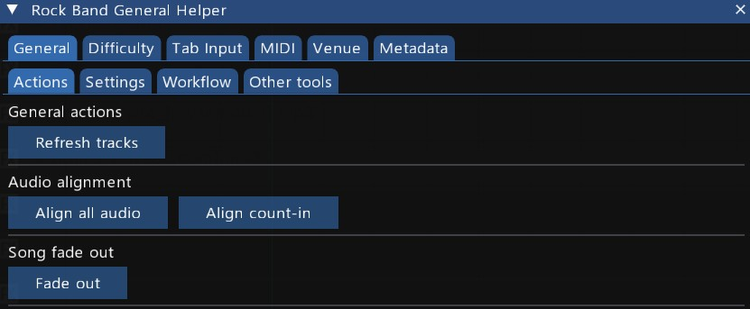

#### Refresh tracks

Re-scans the project's track list to pick up any tracks added or renamed after the script opened.

#### Audio alignment

##### Align all audio

Moves every single-item audio track in the project to start at the same position as the **SONG AUDIO** track. Useful when drum and instrument stems were exported separately and landed at different positions.

- Tracks with zero audio items (MIDI tracks, empty tracks) are silently skipped.
- Tracks with multiple audio items are skipped and listed in the result.
- **COUNT IN** is always excluded — use **Align count-in** for that track.
- Fully undoable.

##### Align count-in

Positions **COUNT IN** clips at the standard count-in beat slots derived from the project's root tempo marker time signature:

| Time sig   | Slots                                         |
| ---------- | --------------------------------------------- |
| 4/4        | m1 beats 1, 3 → m2 beats 1, 2, 3, 4 (6 clips) |
| 3/4        | m1 beat 1 → m2 beats 1, 2, 3 (4 clips)        |
| Other even | m1 beat 1 + midpoint → m2 all beats           |

Clips beyond the 6-slot cap are left untouched and listed in the result. Fully undoable.

#### Song fade out

**Fade out** creates a volume fade on the **SONG AUDIO** track (not the master track) spanning the current time selection — a time selection is required. The fade starts at the track's existing volume level at the selection start and reaches silence at the selection end. Any existing envelope points inside the selection are replaced; points outside it are untouched. Fully undoable.

The result panel adds a heads-up if the selected range looks unusual for a game fade out: under 2 seconds ("likely to sound like a cut"), 5–8 seconds ("on the longer side"), or over 8 seconds ("quite long"). Pick a range that starts at a musically meaningful point (e.g. the end of the last vocal phrase) for the most natural-sounding cutoff.

### Settings sub-tab

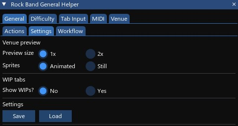

**Venue preview** — the default preview size (1×/2×) and sprite display mode (Animated/Still), shared with the Venue → Preview sub-tab and the standalone Venue Preview window (see [below](#standalone-venue-preview)).

**Show WIPs?** — toggles whether the Tempo Map, Drums, Keys, and Guitar tabs appear (see [WIP tabs](#wip-tabs)). Default No.

**Save** writes the current slider values to the project using REAPER's project state. **Load** restores them. Settings are loaded automatically when the script opens (if a save exists) and when you switch REAPER project tabs.

**What is saved:** all Tempo Map sliders and the override checkbox.

**What is not saved:** track selections. The script re-detects KICK, SNARE, KIT, and Fallback tracks by name on each open and project switch.

### Workflow sub-tab

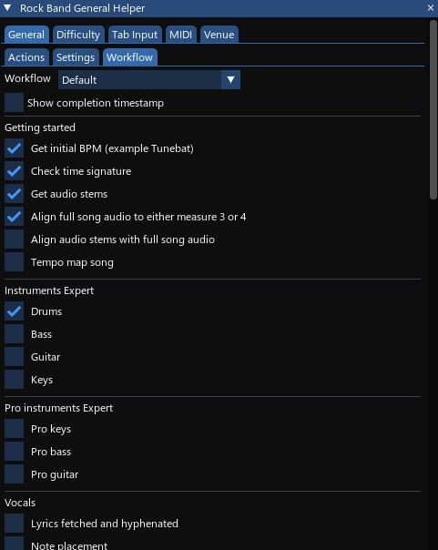

A per-project authoring checklist: a list of steps, grouped into sections, that you check off as you finish them — handy for picking up where you left off after a break, or when juggling several songs at once. The checklist comes from a plain-text template file, so you can tailor the list of steps to how you actually work (e.g. a shorter checklist for an instrumental song with no vocals).

#### Choosing a template

**Workflow** combo — pick a `.txt` file from `resources/workflow/`. The script ships with one starter template, `Default.txt`, covering a typical full-band song end to end. If the folder has no `.txt` files, the tab shows a disabled hint instead. If your saved project doesn't have a template selected yet (first use, or the file it had selected was deleted), a template literally named `Default` is picked automatically; if there's no `Default`, the first template alphabetically is used instead.

**Show completion timestamp** — checkbox, off by default. When on, a checked item shows "Completed on dd.MM.yyyy at hh:mm" underneath it. The timestamp is recorded the moment you check an item either way — this checkbox only controls whether it's displayed.

**Show only unfinished** — checkbox, off by default. When on, checked items are hidden so you can focus on what's left; a section whose every item is checked disappears entirely. Nothing is lost — turn the checkbox back off to see everything again.

A **progress line** ("10 / 40 completed - 25%") sits below the checkboxes once a template is selected, counting the whole template regardless of whether "Show only unfinished" is hiding some of it.

#### Checking off items

Click the checkbox or the item's label text to toggle it — both work. Checking an item saves immediately to the project (its own save slot, independent of this tab's own Save/Load buttons below), so you don't need to remember to hit Save before closing REAPER. Unchecking an item clears its recorded time.

Checked state is tracked per **section + item**, not by the item's text alone — so if two different sections both have a step called "Guitar" (as the starter template does, under both "Instruments Expert" and "Difficulty reductions"), checking one doesn't check the other.

If you switch to a different template, any step whose section heading *and* step text match exactly what you had checked before carries its checked state and timestamp over. Anything reworded, moved to a different section, or new to the template starts unchecked — you decide whether to re-check it.

#### Writing your own template

A template is a plain `.txt` file in `resources/workflow/`, one entry per line:

| Line looks like            | Becomes                                                                 |
| --------------------------- | ------------------------------------------------------------------------ |
| `[Section Name]`            | A section heading — not checkable, just groups the steps under it.      |
| `Some step`                 | A checkable step.                                                        |
| `Some step {a hint}`        | A checkable step with a hover tooltip ("a hint"), stripped from the label. |
| `{a hint}` on its own line  | Attaches as the tooltip to the step on the line right above it.         |

Copy `Default.txt` as a starting point and rename/reorder/add/remove lines freely — the checklist rebuilds from whatever's in the file the next time you select it.

A couple of edge cases are handled predictably rather than guessed at:

- If a step somehow ends up with more than one tooltip attached (e.g. it already has a same-line `{...}` *and* a `{...}` line follows it, or it has two `{...}` groups on the same line), the tooltip is dropped rather than picking one arbitrarily.
- The tab warns you (above the checklist) if a template file has the same step repeated twice under the same section — almost always a copy-paste slip — or if its `[` / `]` or `{` / `}` brackets don't balance, which usually means a bracket got deleted or mistyped somewhere in the file. Both are just warnings; the rest of the file still loads.

Switching templates (via the combo) immediately drops checked history for any step that doesn't match the newly-selected template — only whichever template is currently selected keeps its checked state around. If a step's section+label happens to match between the old and new template it survives the switch (see [Checking off items](#checking-off-items) above); anything else is gone, including if you switch back later. Keep this in mind if you're bouncing between two templates for the same song — history isn't retained per-template, only for whichever one is currently selected.

---

### Other tools sub-tab

Buttons that open the other tools in this set, so you don't have to go back to REAPER's Actions list to switch between them. Two groups:

- **Main tools** — Vocal Helper, Music Theory Helper.
- **Standalone windows** — Venue Preview, Pitch Tuner, MIDI Pattern.

Each opens in its own window and runs independently of this one — closing the General Helper doesn't close them, and they keep their own settings. The General Helper itself isn't listed, since you're already in it.

Opening a tool for the first time also **registers it in REAPER's Action list**, which is what lets you give it a keyboard shortcut or a toolbar button afterwards (**Actions → Show action list**, then search for its name). It's never removed again — un-registering would delete the entry along with any shortcut you'd bound to it, and re-adding it later produces a different internal ID, so the shortcut couldn't be restored. Clicking a tool that's already open just says so instead of opening a second copy.

A tool that isn't installed next to this script is greyed out with a note saying which file is missing, rather than failing when you click it. Put the `.lua` files back in one folder and the button re-enables on its own within a couple of seconds — no need to restart the script.

---

## Difficulty tab

Contains four sub-tabs: **Pro Keys**, **Keys**, **Guitar/Bass**, and **Drums**. Each has the same two rows:

- **Copy to Hard / Medium / Easy** — actually writes notes: copies from the immediately higher tier (Copy to Hard ← Expert, Copy to Medium ← Hard, Copy to Easy ← Medium) onto the target tier's own track/range, giving you a real starting point to hand-reduce rather than a read-only suggestion. If the source tier has no notes, it does nothing and reports that; if the target tier already has notes, a confirmation popup asks before clearing and overwriting them. Pro Keys is the one exception — it copies its whole note set (gems and lane-shift markers alike) verbatim, since the markers aren't optional there.
- **Validate Expert / Hard / Medium / Easy / All** — checks the actually-authored notes in that difficulty's own pitch range against RBN rules (read-only). Also cross-checks against the tier above and flags an un-reduced copy (identical note count/shape) so you know the difficulty still needs work.

All actions respect time selection.

### Pro Keys sub-tab

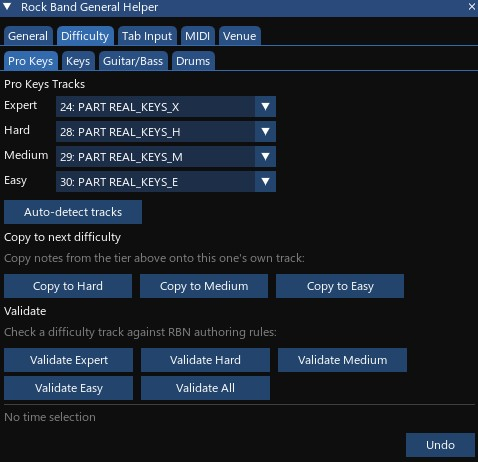

Validates PART REAL_KEYS_X/H/M/E (one track per difficulty, auto-detected by name). Checks chord count/span, interval jumps, spacing (Medium/Easy), and lane range markers. Only notes in the playable C2–C4 range are read as chord/gem events.

### Keys sub-tab

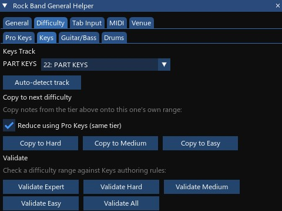

Validates PART KEYS, which carries all four difficulties in separate pitch ranges:

| Difficulty | Pitch range |
| ---------- | ----------- |
| Expert     | 96–100      |
| Hard       | 84–88       |
| Medium     | 72–75       |
| Easy       | 60–62       |

Checks chord count, spacing, note length, and sustain gaps. A **Reduce using Pro Keys (same tier)** checkbox (on by default) makes Copy to Hard/Medium/Easy keep only the copied events that land on a note in the matching-tier Pro Keys track — mirroring a reduction you've already hand-charted on Pro Keys onto the Keys copy — instead of copying every event from the tier above unfiltered.

### Guitar/Bass sub-tab

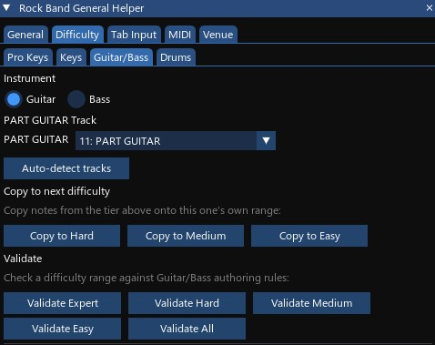

An instrument radio switch validates either PART GUITAR or PART BASS (Guitar and Bass share one rule set). Checks chord count/shape (per-difficulty max span), note length, overlap, sustain gaps, an advisory note-density check, force-HOPO markers, and trill/tremolo marker velocity. Pitch ranges: Expert 96–100, Hard 84–88, Medium 72–75 (no Orange), Easy 60–62 (Green/Red/Yellow only).

### Drums sub-tab

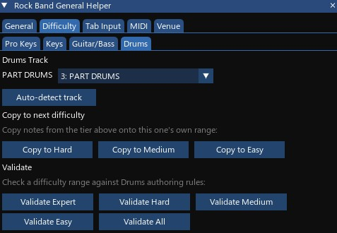

Validates PART DRUMS (Expert 96–100, Hard 84–88, Medium 72–76, Easy 60–64). Checks base chord/kick-pairing rules plus a set of layered density and grid rules that cascade from Hard down through Medium and Easy, and shows a block of non-pass/fail authoring hints for the more qualitative RBN guidance (e.g. "favor crash over kick" on Easy).

---

## Tab Input tab

A **reference guide, not a converter** — every mode here parses ASCII tab text and reports the resulting gem/pitch assignment in the result panel. Nothing is ever written to the project. Use the Guitar, Keys, or Drums tabs (or hand-authoring) to actually write notes; use Tab Input to plan chord shapes and check range/spacing before you do.

Three sub-tabs — **Guitar / Bass**, **Keys / Pro Keys**, **Vocal** — share the same input area:

### Accepted formats

- **Horizontal tab** — one line per event, six space-separated tokens (fret number, or `-`/`x` for unplayed), left = lowest string (E) up to right = highest (e). This is standard chord notation: `x 3 2 0 1 0` is C major. Multi-digit frets are supported; a blank line marks a phrase break.
- **Vertical tab** — six rows (one per string), standard ASCII tab layout so the top row is the high e and the bottom the low E. Space-separated tokens per row, columns read left-to-right as events; an all-dash column marks a phrase break.

The two formats run in opposite directions because the two notations really are written that way — a one-line fret shape starts at the low E, ASCII tab puts the high e on top. Both match how you'd find them printed anywhere else, so neither is the odd one out.

**Add note** appends an empty slot to the input (an all-dash line/column) — it doesn't touch the project either.

### Guitar / Bass

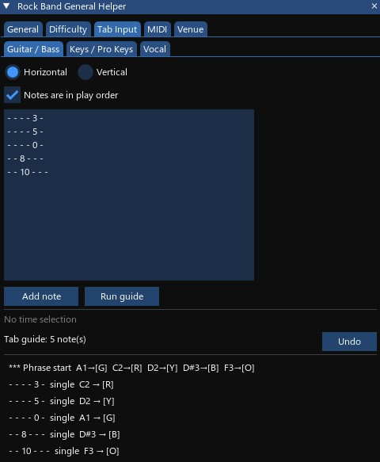

**Run guide** reports the per-event gem assignment and reasoning. Each chord is classified whole, by its distinct **pitch classes** — the gem count follows from the harmony (2 for a dyad, 3 for a real triad), never from how many strings were struck, so octave doublings don't consume a gem. A power chord always gets a matching 1-3 lane spread whether it's voiced on two strings or five, and the report calls out the recognized chord name. This is the same analysis the Music Theory helper's **Shape Search** performs, and the two tools agree on every shape.

Chord-shape ranking then assigns lane position by pitch (higher pitch trends toward Orange, lower toward Green, mirroring real fretboard hand movement). When a passage has more distinct shapes than available lane combos, the shapes that appear first each claim their own combo; any later shape reuses whichever combo it conflicts with the least, based on which chords are actually back-to-back in the passage — two genuinely adjacent chords only ever end up looking identical when it's truly unavoidable, flagged with `(*Wrap)` in the report.

The Guitar tab converter's **Max chord**, **Allow 1-4**, and **Phrase gap** settings do not apply here — this tab writes nothing, so there is nothing to fit to a chart. Phrase breaks come from blank lines in the tab input.

### Keys / Pro Keys

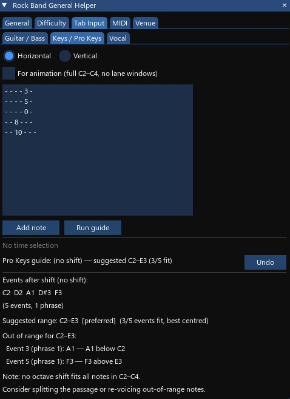

An extra **"For animation (full C2–C4, no lane windows)"** checkbox: off scores against a 10th-wide Pro Keys lane window and suggests the best lane range; on scores against the full C2–C4 range instead (for planning `PART KEYS_ANIM_RH/LH` notes). **Run guide** finds the best octave shift to fit the notes into C2–C4 (MIDI 48–72), lists anything still out of range, and flags chords wider than the 12-semitone Expert max.

### Vocal

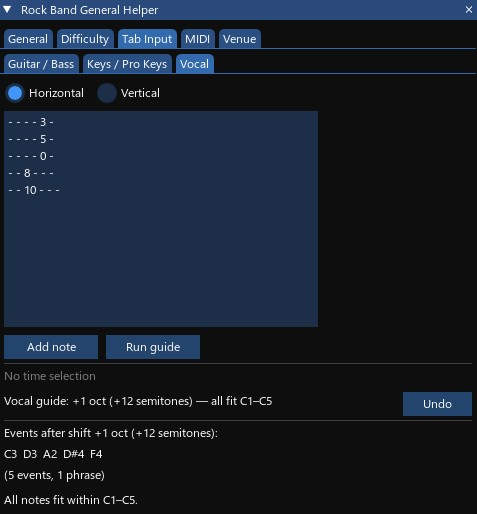

**Run guide** finds the best octave shift to fit the notes into the wider C1–C5 vocal range (MIDI 36–84), lists anything still out of range, and flags overly wide chords. Blank lines separate phrases.

---

## MIDI tab

Three sub-tabs: **Alignment**, **Length**, and **Pattern**.

### Alignment sub-tab

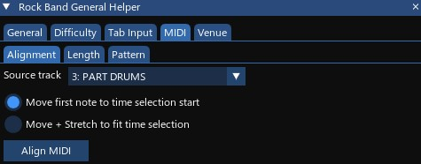

Aligns a single imported MIDI item to the project grid.

#### Modes

- **Move only** — shifts the item so its first note lands at the time selection start. Useful for rough alignment when tempo is known.
- **Move + Stretch** — also adjusts the take playback rate so the last note aligns with the time selection end. Use this when the MIDI was recorded at a slightly different tempo and needs to stretch to fit the project grid.

#### Workflow

1. Set a time selection over the target range.
2. Select the source track in the dropdown.
3. Click **Align MIDI**.

The result panel reports the shift amount in milliseconds and, when stretching, the playback rate change. Fully undoable.

### Length sub-tab

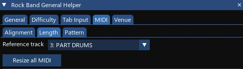

Resizes MIDI items to match a reference track's length — useful after aligning several imported MIDI tracks whose items ended up different lengths.

1. Select the **Reference track** — the MIDI track already sized to the full song length.
2. Click **Resize all MIDI**.

For every other track, the first MIDI item is resized (its right edge moved) to match the reference item's length exactly — notes are never moved or deleted. Items that don't start at project position 0 are skipped and reported (those are Alignment's job, not Length's). Fully undoable; the result warns if any item was shrunk, so you can verify no notes were cut off.

### Pattern sub-tab

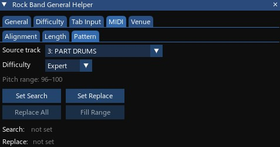

Finds and replaces a recurring note pattern across a MIDI track, or tiles a pattern across a range.

1. Select the **Source track**.
2. Make a time selection over an example of the pattern you want to search for, then click **Set Search** to capture it.
3. Make a time selection over the pattern you want to replace it with, then click **Set Replace** to capture it. Both patterns must span the same duration — capturing a differently-sized Search clears any existing Replace.
4. Click **Replace All** to scan the track (within the time selection if one is active, otherwise the whole item) and swap in the Replace pattern wherever the Search pattern matches exactly (same pitches, same relative timing).
5. Or click **Fill Range** to tile the Replace pattern repeatedly across the current time selection — no Search pattern needed.

A live readout under the buttons shows what's currently captured (e.g. "M4–M6 (2 measures with 5 notes)" or "not set"). All actions are fully undoable.

<a id="standalone-midi-pattern"></a>

#### Standalone MIDI Pattern window

`rock_band_midi_pattern_vkr.lua` (repo root) is a separate script that opens just this sub-tab in its own window — load it the same way as the main scripts (**Actions → Show action list → Load ReaScript**), or click **MIDI Pattern** in [General → Other tools](#other-tools-sub-tab). Handy for keeping it beside REAPER's MIDI editor without the helper's other tabs coming along. Same underlying behavior as above, plus its own **Refresh tracks** button (the main window keeps that in General → Actions) and its own status line with an Undo button.

It has no settings of its own to save — this sub-tab has never had any — and switching REAPER projects clears the captured Search and Replace patterns rather than leaving them pointing at the previous project's MIDI item.

---

## Venue

The Venue tab contains seven sub-tabs, in this order: Actions, Events, Themes gen, Section gen, Manual gen, Keyframes, Preview. The script finds the VENUE and EVENTS tracks automatically by name — no dropdown needed.

An **Active players** row is shown below every sub-tab (see [below](#active-players-row)).

### Actions sub-tab

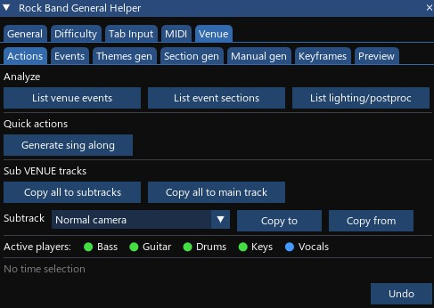

Inspection and utility actions that don't fit the generation sub-tabs.

**List venue events** audits all MIDI text events on the VENUE track against the Rock Band Network specification. It reports:

- **Track name event** — whether a single `"VENUE"` type-3 event exists at PPQ 0.
- **Unknown events** — text events not in the RBN spec; these cause compile errors.
- **Consecutive camera repeats** — the same directed or coop shot used back to back.
- **Directed cut spacing** — directed cuts within 2 s of the next camera event.
- **Camera gap statistics** — average, slowest, and fastest cut durations for coop→any and directed→coop transitions.
- **Event frequency count** — how many times each event is used, sorted by frequency.

**List event sections** reads `[prc_*]` markers from the EVENTS track and lists all detected song sections with time ranges. Letter-suffix variants (`[prc_verse_1a]`, `[prc_verse_1b]`) are merged into a single section entry.

**List lighting/postproc** finds every `[lighting*]` and `*.pp]` (postproc) text event on the VENUE track and lists them in timeline order of appearance, each with its measure/timestamp location.

**Validate lighting/blends** checks the lighting and post-process authoring on the VENUE track — the keyframe and blend rules described below. It's read-only: it never changes the track, it just tells you what it found and what to do about it.

*Keyframes.* A `[first]` is a manual lighting event's own opening keyframe, so it belongs on that event's **exact tick**. The check reports:

- **Manual lighting changes missing a `[first]`** — a manual preset (`verse`, `chorus`, `manual_cool`, `manual_warm`, `dischord`, `stomp`) that starts running where a different one was running before.
- **`[first]` events off a lighting change** — every `[first]` that isn't on such an event, each with the reason and the fix: *move it* when it's within a beat of a change that's missing one (so fixing the first list doesn't leave you with two), or *delete it* when it sits on a blend anchor, on an automatic preset (which takes no keyframes), on a tick with no lighting event at all, or is a second copy on a tick that already has one.

An event that repeats the preset already running gets no `[first]` and is never flagged for lacking one — see blending below.

*Blending.* By default a preset change is a **hard cut**: the new lighting snaps in at its event. To make it fade instead, the **outgoing** preset is restated a beat or two before the change, giving the game something to interpolate from:

```
m3     [lighting (stomp)]  [first]
m9 b4  [lighting (stomp)]              <- blend anchor: the OLD preset, restated
m10    [lighting (verse)]  [first]     <- the change itself never moves
```

The anchor is just a duplicate of the preset that's already playing, so it starts no new keyframe train — the `[first]` at m3 keeps running straight through it. Post-process events blend the same way, independently of lighting.

The check lists **lighting changes** and **post proc changes with no blend anchor**, each naming the outgoing preset and where it started, so you know what to restate and where. A hard cut is a perfectly valid choice, so treat this as a list of places a fade *would* need an anchor rather than a list of mistakes. To add one, park the playhead a beat or two before the change and use **Blend** on the Manual gen sub-tab; the generation sub-tabs place them automatically from a theme's `lightpreset_blendin` / `postproc_blendin`.

The whole track is always read — deciding whether an event is a change, and whether an anchor precedes it, needs the events before it — but if a time selection is active only issues inside it are reported, so you can work through a song a section at a time.

**Generate sing along** derives VENUE sing-along notes for the guitarist (pitch 87, from HARM2) and bassist (pitch 85, from HARM3) out of each harmony track's vocal phrases, merging phrases less than a measure apart into one continuous note. Only the pitch of a harmony track that's present and unmuted is touched — a muted or missing source is left alone. Always processes the whole song. Fully undoable.

**Sub VENUE tracks** splits VENUE's events across 6 category tracks for easier authoring once a song has accumulated a lot of keyframes, then merges them back:

- **Copy all to subtracks** creates (if missing) "VENUE normal camera", "VENUE directed camera", "VENUE lighting", "VENUE keyevents", "VENUE post proc", and "VENUE special", each with a MIDI item matching VENUE's own position/length, placed directly after VENUE. Newly created tracks start muted — this split is an editing convenience with no meaning to the exported song, and muting keeps the software that packages the final MIDI/audio from flagging them as unrelated/unused — and inherit VENUE's custom MIDI note names, plus a take named after the track so open MIDI editor tabs are identifiable instead of all showing as "MIDI take". VENUE's own MIDI notes (e.g. the sing-cue notes) land on "VENUE special" alongside its text events, the only category that ever carries notes. Safe to re-run any time to re-sync after editing VENUE directly.
- **Copy all to main track** does nothing (with a status message) if none of the 6 subtracks exist yet. Otherwise clears VENUE and replaces it with the combined contents of however many subtracks currently exist, including "VENUE special"'s notes. Prompts for confirmation first, since it overwrites the track authoring actually reads from.
- The **Subtrack** dropdown plus **Copy to** / **Copy from** buttons work on one category at a time. Copy to clears just that subtrack and copies the matching events from VENUE into it, creating the subtrack if needed. Copy from clears only that category's events from VENUE (not everything) before copying the subtrack's contents in, but — unlike Copy to — won't create a missing subtrack. For Special, both directions also carry VENUE's MIDI notes along with its text events.
- All of the above always process the whole song. Fully undoable.

### Events sub-tab

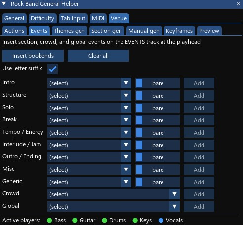

The only sub-tab that writes to the **EVENTS** track instead of VENUE — inserts section, crowd, and global marker events at the playhead.

- **Use letter suffix** checkbox (default on) — when on, **Add** inserts only lettered part forms (`[prc_verse_1a]`, then `[prc_verse_1b]`, …), used to split a long section into parts that merge back into one section in Section gen. When off, Add inserts only the plain form and refuses if it already exists. Events with no lettered variants (e.g. `[prc_bre]`) always insert the plain form either way.
- One row per event group — **Intro, Structure, Solo, Break, Tempo/Energy, Interlude/Jam, Outro/Ending, Misc** (numbered `[prc_*]` section markers), **Generic** (`[prc_a]`–`[prc_k]`, lettered-only, for parts that fit no named category), **Crowd** (`[crowd_*]`), and **Global** (`[music_start]`, `[music_end]`, `[end]`, `[coda]`). Each row has a base-name combo, a number stepper where applicable, a live `-> <event>` indicator showing exactly what the next Add will insert (or `-> (blocked)` with the reason on hover), and an **Add** button.
- Inserts are validated: no duplicates (reports the existing event's location), no mixing plain and lettered forms of the same event, numbers/letters must be used in sequence, and only one text event per position (crowd events are exempt and may stack anywhere).
- **Insert bookends** removes any existing instances of the six bookend events, then inserts the minimal per-song set: `[prc_intro]` + `[crowd_normal]` at measure 1, `[music_start]` at measure 3, and `[prc_outro]`/`[music_end]`/`[end]` near the end of the song. Skips the end trio on items under 7 full measures; occupied target spots are skipped and reported.
- **Clear all** removes every text event from the EVENTS track (the track-name event itself is kept).

All Events actions are fully undoable.

### Themes gen sub-tab

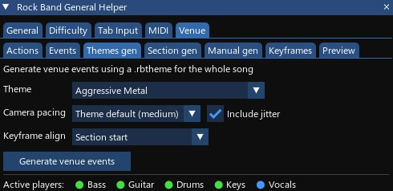

Whole-song generation driven by a `.rbtheme` file.

- **Theme** — select a `.rbtheme` file from the `resources/themes/` folder. Shows `(select a theme)` when none is loaded; Generate is disabled until a theme is chosen. If the folder is empty, all inputs are disabled.
- **Camera pacing** — override the theme's camera cut rate, or keep the theme default. A jitter toggle adds ±20 % randomisation to cut intervals for a more natural feel.
- **Keyframe align** — global alignment mode for `[first]`/`[next]` keyframe events. Options: Section start, Closest beat, Downbeat, and five instrument-aware modes (Guitar notes, Bass notes, Keys notes, Drum kicks, Drum snare) that place `[next]` only at beats where notes exist on the corresponding PART track.
- **Generate venue events** — generates camera cuts, lighting changes, manual-lighting keyframes, and post-process effects on the VENUE track. Camera pools are filtered by which PART instrument tracks are present and unmuted. Respects time selection (partial regeneration). Fully undoable.

### Section gen sub-tab

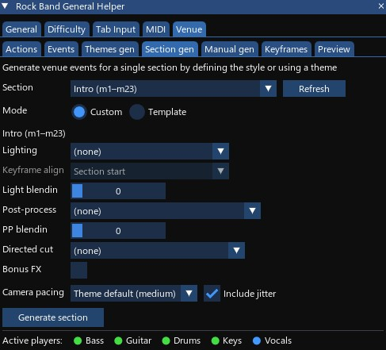

Per-section manual configuration. Sections are read from `[prc_*]` markers on the EVENTS track.

- **Section selector** — pick a song section. **Refresh** re-reads sections from the EVENTS track.
- Per-section settings:
  - **Lighting** — lighting preset for this section (manual or auto).
  - **Keyframe align** — alignment mode for `[first]`/`[next]` events (disabled for auto/no lighting).
  - **Keyframe rate** — how often `[first]`/`[next]` events are placed (beats).
  - **Light blendin** — place the lighting event N beats before the section start.
  - **Post-process** — post-process effect for this section.
  - **PP blendin** — place the post-process event N beats before the section start.
  - **Directed cut at start** — insert a forced directed camera cut at the section start.
  - **Bonus FX** — insert a `[bonusfx]` event at the section start.
- **Camera pacing** — camera cut rate override for the generated section.
- **Generate section** — generates events for the selected section only. Fully undoable.

### Manual gen sub-tab

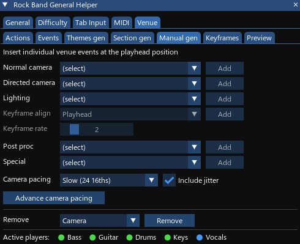

Shot-by-shot event insertion at the edit cursor.

- **Normal camera** — pick any `[coop_*]` shot; **Add** inserts it at the edit cursor.
- **Directed camera** — pick any `[directed_*]` shot including BRE events; **Add** inserts it.
- **Lighting** — pick any lighting preset; **Add** inserts `[lighting (name)]`. When a manual preset is selected, Keyframe align and Keyframe rate controls appear.
- **Post proc** — pick any `[*.pp]` effect; **Add** inserts it.
- **Special** — `[bonusfx]`, `[bonusfx_optional]`, `[first]`, `[next]`, `[previous]`; **Add** inserts the chosen event.
- **Camera pacing** — shared camera pacing override (same state as the other gen tabs).
- **Advance camera pacing** — moves the edit cursor forward by one jittered camera interval.
- **Generate keyframes** — generates `[first]`/`[next]` from the cursor to the next lighting event, time selection end, or VENUE item end. Clears existing keyframe events in the range first. Only available when a manual lighting preset is selected. Fully undoable.
- **Remove** — category dropdown (Camera / Lighting / Post proc / Special / All) + **Remove** button; removes matching events from the time selection (if active) or the full song. Fully undoable.

### Keyframes sub-tab

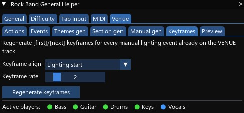

Bulk-regenerates `[first]`/`[next]` keyframes for every manual lighting event already sitting on the VENUE track — useful after moving or retiming a section rather than re-adding keyframes by hand.

- **Keyframe align** — alignment mode: **Lighting start** (default, anchors at the lighting event itself), **Closest beat**, **Downbeat**, or five instrument-aware modes (**Guitar notes**, **Bass notes**, **Keys notes**, **Drum kicks**, **Drum snare**) that place `[next]` only at beats where notes exist on the corresponding PART track.
- **Subdivision** — Every beat / Every half beat / Every quarter beat, shown only for the instrument-aware align modes.
- **Keyframe rate** — this tab's own rate (beats), independent of Section gen's and Manual gen's.
- **Regenerate keyframes** — finds every manual lighting event on VENUE (`verse`, `chorus`, `manual_cool`, `manual_warm`, `dischord`, `stomp`), and for each one inside the processing range, clears and regenerates its `[first]`/`[next]` running from that lighting event to the next lighting event of any kind. Only keyframe events are touched — camera, lighting, postproc, and bonus FX are left alone. Respects time selection (a section already in progress from before the selection is left untouched); otherwise processes the whole song. Fully undoable.

### Preview sub-tab

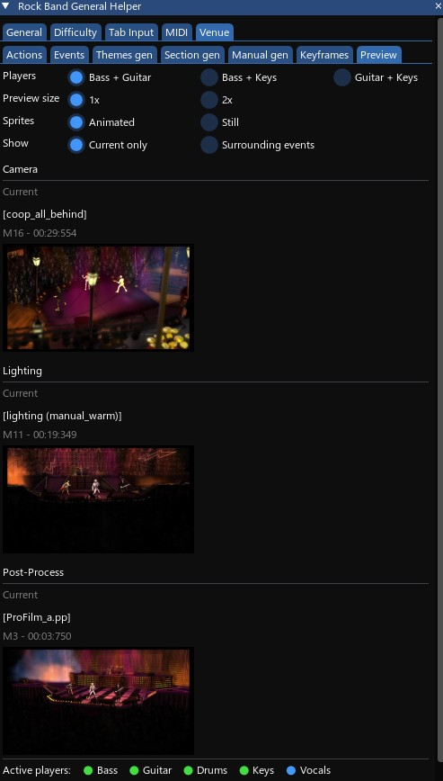

Live readout of current, previous, and next venue events relative to the playhead (or edit cursor when stopped). Updates automatically when the VENUE track changes.

- **Players** — select which two instruments are in the lineup (Bass + Guitar, Bass + Keys, Guitar + Keys). Camera shots requiring the absent instrument are shown with an alternative event, or highlighted in red if no alternative exists at that position.
- **Preview size** — inline sprite display scale: 1× (213×120 px) or 2× (426×240 px).
- **Sprites** — Animated (plays through all frames) or Still (single middle frame).
- **Show** — Current only (one column) or Surrounding events (Previous / Current / Next columns).

Sprite previews require JPEG spritesheets installed under `resources/img/spritesheets/`. If no spritesheets are found, event names are shown as text with no image.

If the VENUE track is large and reading takes more than 150 ms, auto-refresh pauses automatically. A **Resume auto-refresh** button appears to re-enable it.

<a id="active-players-row"></a>

### Active players row

Shown below every Venue sub-tab (and in the [standalone Venue Preview window](#standalone-venue-preview)): a colored dot per instrument (Bass, Guitar, Drums, Keys, Vocals) shows its play state at the current playhead (playback) or edit cursor (stopped) — exactly what venue generation would treat that instrument as at that point:

- **Green** — active (`[play]`/`[mellow]`/`[intense]`)
- **Blue** — idle (`[idle]`/`[idle_realtime]`)
- **Red** — track is muted or missing, so it's excluded from venue generation
- **Orange** — no `[play]`/`[idle]` events found on the track; treated as always active

Hover a dot for the exact state and how long it's held.

<a id="standalone-venue-preview"></a>

### Standalone Venue Preview

`rock_band_preview_vkr.lua` (repo root) is a separate script that opens just the Preview sub-tab and Active players row in their own window — load it the same way as the main scripts (**Actions → Show action list → Load ReaScript**). Handy for keeping the preview visible in its own window next to the generation tabs instead of switching tabs back and forth. Same underlying behavior as Venue → Preview above.

### Validated event categories

The VENUE spec includes three categories of events:

| Category            | Examples                                                           |
| ------------------- | ------------------------------------------------------------------ |
| **Camera cuts**     | `[coop_all_near]`, `[directed_drums]`, `[directed_vocals_cls]`, …  |
| **Post-processing** | `[bloom.pp]`, `[film_b+w.pp]`, `[video_trails.pp]`, …              |
| **Lighting**        | `[lighting (verse)]`, `[lighting (frenzy)]`, `[lighting (bre)]`, … |

---

## Troubleshooting

### Venue

**List venue events reports no events.**
Confirm a track named `VENUE` exists in the project. The track must have MIDI items with text events — audio items are ignored.

**Unknown events are listed but the event names look correct.**
Check for typos, extra spaces, or wrong bracket style. The validator does an exact string match against the RBN spec list.

---

For Tempo Map, Drums, Keys, and Guitar — the experimental tabs behind **Show WIPs?** — see **[README_WIP.md](README_WIP.md)**, which also has their own Tips, Troubleshooting, and Known limitations sections.
