# Rock Band Vocal Helper

← [Back to overview and installation](../README.md)

**Generate timing-aligned MIDI notes from a vocal stem, with lyric assignment built in.** A REAPER ReaScript that analyses a vocal audio track and generates MIDI notes aligned to the syllables and phrases it detects, then assigns lyrics to those notes.

Designed for authoring Rock Band-style vocal charts — it defaults to the RB3 vocal pitch range (C1–C5) and the standard phrase-marker convention (pitch 105) — but the timing detection and lyric assignment work for any rhythm/karaoke MIDI workflow.


---

## Quick start

1. Open a REAPER project with a vocal stem on one track and a destination track with a MIDI item on it.
2. Run the script. The window opens and attempts to auto-select the right tracks (it looks for tracks named `VOCALS AUDIO` / `DRYVOX1` for audio and `PART VOCALS` for MIDI destination).
3. Open the **Tuner** tab and press play — it reads back the detected pitch live as you play, no notes required.
4. Once you have notes on the destination track (placed by hand, or via the experimental Note Placement tab), use **Pitch**, **Lyrics**, **Pitch slide**, **Harmonies**, and **Validation** to refine them.
5. Automatic note detection/generation (Dry run / Generate) is currently experimental — enable it via General → Settings → **Show WIPs?** (see [README_WIP.md](README_WIP.md)).

---

## Window overview

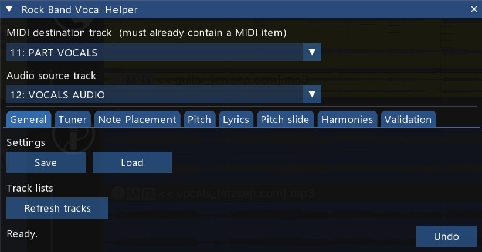

The script window has a persistent track-selector row at the top and a status/result panel at the bottom. Everything in between is organised into tabs:

| Area                   | Description                                                                                         |
| ---------------------- | ----------------------------------------------------------------------------------------------------- |
| Track selectors        | Above the tab bar — Audio source, MIDI destination; always visible                                  |
| **General** tab        | Save / Load project settings; Refresh tracks; Show WIPs toggle; buttons that open the other tools   |
| **Tuner** tab          | Live pitch detector — reads audio at the playhead and shows the current note, Hz, and history       |
| **Pitch** tab          | Pitch source for Apply pitch changes: Built-in detection (YIN) or Reference MIDI; Snap to Key Scale |
| **Lyrics** tab         | Select a lyrics file, assign or clear lyric events                                                  |
| **Pitch slide** tab    | Scan existing notes for pitch slides (glides, scoops, bends)                                        |
| **Harmonies** tab      | Copy lead vocal notes to up to three harmony tracks, transposed or keeping the target's own pitches |
| **Validation** tab     | Validate phrase markers; check phrase similarity to catch copy errors                               |
| Status / Undo          | Below the tab bar — result of the last action, and the Undo button                                  |

<a id="wip-tabs"></a>

| WIP tab (hidden by default) | Purpose                                                                 |
| ----------------------------- | ------------------------------------------------------------------------ |
| **Note Placement**            | Detect syllable/phrase timing from the audio and generate/snap MIDI notes |

Enable it via **Show WIPs? = Yes** on the General tab's Settings sub-tab; it appears after Validation in the tab bar. It works at a basic level but has known issues and isn't ready for general use — see **[README_WIP.md](README_WIP.md)** for its full documentation.

---

## Setting up your tracks

You need two tracks before running the script:

- **Audio source track** — contains the vocal stem (an isolated vocals-only audio file, e.g. from an AI stem separator like Demucs or UVR).
- **MIDI destination track** — contains a MIDI item that spans the region you want to work on. The script writes into this existing item; it will not create a new one.

If you plan to use **Reference MIDI** as the pitch source on the Pitch tab, add a third track containing the reference notes.

---

## Time selection

If you only want to process part of the song, make a time selection in REAPER before running any action. The script respects the time selection for detection, auto-tune, apply pitch changes, and pitch slide scanning.

Without a time selection, the full audio item is analysed.

---

## General tab

Contains three sub-tabs: **Actions**, **Settings**, and **Other tools**.

### Actions sub-tab

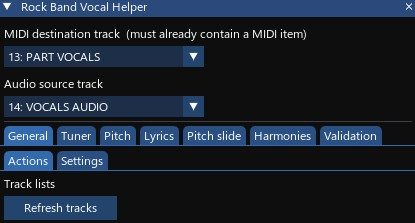

**Refresh tracks** re-scans the project's track list to pick up any tracks added or renamed after the script opened.

### Settings sub-tab

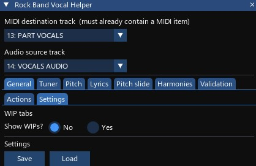

**Show WIPs?** — toggles whether the Note Placement tab appears (see [WIP tabs](#wip-tabs)). Default No.

Settings are saved per-project using REAPER's project state. Click **Save** to store the current Detection and Pitch settings. Click **Load** to restore them.

Settings are loaded automatically when the script opens (if a save exists for the current project) and when you switch REAPER project tabs.

**What is saved:** all Detection sliders, Pitch source selection and all pitch settings (including YIN parameters), Velocity, Slide Scan settings, Harmonies destination enabled/copy style/lyric-suffix options, Harmonies key selection, Copy phrase markers, Snap to Key Scale settings (key, scale, avoid-collision), Phrase Similarity threshold and mode, and the Show WIPs toggle.

**What is not saved:** track selections. If your project follows the naming convention (`VOCALS AUDIO`, `PART VOCALS`, `HARM1–3`) the script will re-select the right tracks automatically. The Harmonies key-detection results are session-only and reset on each open.

### Other tools sub-tab

Buttons that open the other tools in this set, so you don't have to go back to REAPER's Actions list to switch between them. Two groups:

- **Main tools** — General Helper, Music Theory Helper.
- **Standalone windows** — Venue Preview, [Pitch Tuner](#standalone-pitch-tuner).

Each opens in its own window and runs independently of this one — closing the Vocal Helper doesn't close them, and they keep their own settings. The Vocal Helper itself isn't listed, since you're already in it.

Opening a tool for the first time also **registers it in REAPER's Action list**, which is what lets you give it a keyboard shortcut or a toolbar button afterwards (**Actions → Show action list**, then search for its name). It's never removed again — un-registering would delete the entry along with any shortcut you'd bound to it, and re-adding it later produces a different internal ID, so the shortcut couldn't be restored. Clicking a tool that's already open just says so instead of opening a second copy.

A tool that isn't installed next to this script is greyed out with a note saying which file is missing, rather than failing when you click it. Put the `.lua` files back in one folder and the button re-enables on its own within a couple of seconds — no need to restart the script.

---

## Tuner tab

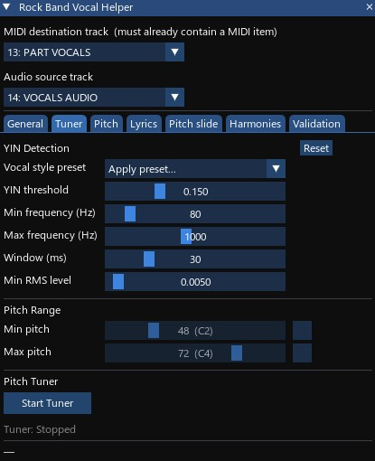

The **Tuner** tab is a live pitch detector. While active it reads audio from the selected source track at the current playhead position every 100 ms and displays the detected note.

### Starting and stopping

Click **Start Tuner** to begin. The button label changes to **Stop Tuner**. The tuner also stops automatically in two situations:

- You navigate away from the Tuner tab.
- No new pitch has been detected for 60 seconds while the playhead is stationary (e.g. you stopped playback and stepped away).

### Display

| Element             | Description                                                                                                                                                                                                                                                                                 |
| ------------------- | ------------------------------------------------------------------------------------------------------------------------------------------------------------------------------------------------------------------------------------------------------------------------------------------- |
| **Current pitch**   | Note name with a direction indicator — green `▲` (higher than last detection), red `▼` (lower), or grey `=` (same) — followed by frequency in Hz and project timestamp. Stays visible after you stop.                                                                                       |
| **History strip**   | The last 10 detected notes, newest on the left, dimmed. Only real pitches appear — silence is not logged.                                                                                                                                                                                   |
| **Quiet indicator** | "Quiet — no pitch detected" appears in the status bar at the bottom of the window when audio is silent or not clearly pitched. When playing, it waits 1.5 seconds before appearing so brief syllable gaps and breaths do not trigger it. When the playhead is stopped it appears instantly. |

The Tuner tab shows its own **state indicator** ("Tuner: Active" in green, "Tuner: Stopped" in grey) directly below the Start/Stop button — you do not need to watch the bottom status bar while tuning. The status bar is only used for auto-stop and error messages.

> **Tip:** The display and history stay visible after you stop. Use this as a quick reference — play a few bars, stop, read the results, then jump to the MIDI editor.

### Scrubbing

Dragging the playhead while playback is stopped is also detected — the tuner reads the edit cursor position, so clicking anywhere on the timeline immediately samples that point. The "Quiet — no pitch detected" message in the status bar also appears immediately when you scrub to a silent spot (no 1.5 s delay), giving instant feedback when stepping through the timeline manually.

### Vocal style preset

A **Vocal style preset** combo sits above the YIN sliders on this tab, on the Pitch tab's Built-in detection sub-tab, and on the Pitch slide tab — the same combo and preset list in all three places, since they all share the same underlying YIN settings. Picking a preset fills in a starting point in one click; the combo itself resets to "Apply preset..." afterward and every slider stays editable, so treat it as a starting point to fine-tune rather than a locked mode.

| Preset                          | Sets                                                                                             |
| -------------------------------- | -------------------------------------------------------------------------------------------------- |
| **Low male (bass–baritone)**      | Threshold 0.12, 70–470 Hz, window 40 ms, pitch range E2–A4 (40–69)                                 |
| **Male (tenor / typical rock)**   | Threshold 0.15, 100–620 Hz, window 30 ms, pitch range A2–C5 (45–72)                                |
| **High male (high tenor / belt)** | Threshold 0.15, 130–700 Hz, window 30 ms, pitch range C3–E5 (48–76)                                |
| **Female (alto–mezzo)**           | Threshold 0.15, 160–900 Hz, window 25 ms, pitch range F3–A5 (53–81)                                |
| **High female / falsetto (soprano)** | Threshold 0.15, 220–1200 Hz, window 20 ms, pitch range C4–C6 (60–84)                             |
| **Breathy / raspy (style only)**  | Threshold 0.25, window 45 ms — frequency range and pitch constraints untouched                     |
| **Clean / sustained (style only)**| Threshold 0.10, window 30 ms — frequency range and pitch constraints untouched                     |
| **Piano / keys (tuner, single notes)** | Threshold 0.10, 45–2000 Hz, window 50 ms, tuner Min RMS level 0.002 — no pitch-range constraint |

The five voice-range presets (Low male through High female) also enable the Min/Max pitch range constraints at the listed values — useful as a first line of defense against YIN's octave-snap errors. The two style-only presets and Piano/keys leave pitch-range constraints as they were. Piano/keys additionally shows a soft warning if the selected tracks look vocal-named, since it's meant for a quiet single-note instrument stem instead.

### YIN Detection settings

These are the same settings used by the Pitch tab's Built-in detection mode. Adjusting them here changes the behaviour of both the tuner and Apply pitch changes.

| Slider                 | Range       | Default | Notes                                                                                                                                                                                       |
| ---------------------- | ----------- | ------- | ----------------------------------------------------------------------------------------------------------------------------------------------------------------------------------------- |
| **YIN threshold**      | 0.01 – 0.5  | 0.15    | Confidence gate. Lower = stricter (more `—` on ambiguous audio). Higher = more detections but more risk of wrong results on noise.                                                          |
| **Min frequency (Hz)** | 40 – 400    | 80 Hz   | Set just below the lowest note in the vocal. Narrows the search range and reduces octave errors.                                                                                            |
| **Max frequency (Hz)** | 200 – 2000  | 1000 Hz | Set just above the highest note.                                                                                                                                                            |
| **Window (ms)**        | 10 – 100    | 30 ms   | Analysis window per sample. YIN needs at least one pitch cycle — at 80 Hz that is ~12 ms minimum. Longer windows are more stable; shorter windows track faster.                             |
| **Min RMS level**      | 0.001 – 0.1 | 0.005   | Minimum signal level before pitch detection runs. Raise if silent gaps frequently trigger spurious detections; lower if very quiet passages are being ignored. Saved with project settings. |

### Pitch Range constraints

The same Min pitch / Max pitch checkbox+slider pairs from the Pitch tab. When enabled, detected pitches outside the range are octave-shifted back in before display. Useful for voices where YIN occasionally lands an octave too low or high.

<a id="standalone-pitch-tuner"></a>

### Standalone Pitch Tuner

`rock_band_pitch_tuner_vkr.lua` (repo root) is a separate script that opens just this tab in its own window — load it the same way as the main scripts (**Actions → Show action list → Load ReaScript**). Handy for keeping the live readout visible while you work in another tab (Pitch, Lyrics) or in the MIDI editor, instead of the tuner stopping the moment you navigate away. Same underlying behaviour as the Tuner tab above, with two differences:

- It has its own **Audio source track** selector and **Refresh tracks** button at the top, since it isn't sharing the main window's track selectors.
- It never stops on tab navigation — there are no tabs. The 60-second idle auto-stop still applies, and closing the window stops the tuner.

It reads the same per-project settings the vocal helper saves, so YIN thresholds, confidence, Min RMS level and pitch range carry over. Saving stays in the vocal helper's General tab — this window never writes settings, so changes made here apply for the session only.

---

## Pitch tab

The Pitch tab controls how **Apply pitch changes** re-pitches existing notes on the destination track. **Generate and Dry run always use the Default pitch** (set on the Note Placement tab) and are not affected by anything on this tab.

### Placement sub-tabs

Pitch source is chosen by which sub-tab is open when you click Apply pitch changes — **Placement - Built-in** or **Placement - Reference** — rather than a separate selector; opening a sub-tab makes it the active pitch source.

#### Placement - Built-in

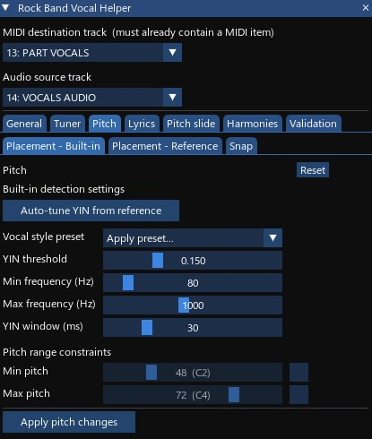

The script analyses the audio directly using the [YIN algorithm](http://audition.ens.fr/adc/pdf/2002_JASA_YIN.pdf) to estimate the fundamental frequency of each note. No external MIDI reference needed. This is the default.

A **Vocal style preset** combo (see [Tuner tab](#vocal-style-preset)) sits above the sliders here too, sharing the same settings.

| Slider            | Range         | Default | Notes                                                                                                                   |
| ----------------- | ------------- | ------- | ------------------------------------------------------------------------------------------------------------------------- |
| **YIN threshold** | 0.01 – 0.5    | 0.15    | Confidence cutoff. Lower = stricter (more fallbacks to Default pitch). Higher = more detections but more octave errors. |
| **Min frequency** | 40 – 400 Hz   | 80 Hz   | Set to just below the lowest note in the vocal.                                                                         |
| **Max frequency** | 200 – 2000 Hz | 1000 Hz | Set to just above the highest note.                                                                                     |
| **YIN window**    | 10 – 100 ms   | 30 ms   | Audio length analysed per note. Longer is more stable but may miss very short notes.                                    |

The algorithm samples audio starting at 30% into each note (to avoid the attack transient and land on the steady-state vowel). Notes where no confident pitch is found fall back to Default pitch.

> **Tip:** If YIN produces consistent pitch errors across a section, use **Auto-tune YIN from reference** to automatically search for better settings.

#### Placement - Reference

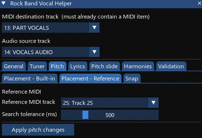

Pitch is taken from an existing MIDI track. For each note, the script finds the nearest MIDI note on the reference track (within the **Search tolerance** window) and uses that pitch. Falls back to Default pitch when nothing is within range.

This works well with MIDI output from AI pitch tools like [Basic Pitch](https://basicpitch.spotify.com/). Import the AI MIDI output onto the reference track, then use this mode to transfer those pitches onto your timing-detected notes.

### Auto-tune YIN from reference

Auto-tune YIN automates finding better YIN parameter values when pitch detection produces consistently wrong results across a section.

**How to use it:**

1. Run **Generate (append)** to produce an initial set of notes.
2. In REAPER's MIDI editor, manually correct the pitches of a representative handful of notes — keep their positions and lengths unchanged.
3. Make a time selection covering those corrected notes.
4. Click **Auto-tune YIN from reference** (the button appears above the YIN sliders, on the Placement - Built-in sub-tab).

The script reads the existing note positions from the MIDI item, sweeps combinations of four YIN parameters (**YIN threshold**, **Min frequency**, **Max frequency**, **YIN window**), and scores each combination against the pitches you corrected. When it finishes, the YIN sliders update to the best-found values and the result panel shows accuracy statistics.

**Scoring is octave-insensitive.** The search measures pitch-class distance — C→C# scores better than C→F, regardless of octave. This separates pitch-class accuracy (what parameter settings affect) from octave correctness (what pitch range constraints fix). Octave mismatches that remain after the search are counted and reported, with a specific suggestion for pitch range constraint values to correct them:

```
Octave mismatches: 3 — reference spans C2–G3
  Consider enabling pitch range: min 48 (C2), max 67 (G3)
```

**What it changes:** YIN threshold, Min frequency, Max frequency, YIN window.
**What it leaves alone:** all Detection sliders, velocity, pitch range constraints, note positions and lengths.

> **Note:** Auto-tune YIN can take several seconds for longer sections. The UI will be unresponsive during the search — this is expected (see [Known limitations](#known-limitations)).

> **Tip:** Use 10–20 reference notes covering a range of pitches in the section. Notes where pitch was already correct do not need to be touched — the search still converges from partial corrections, and more representative notes produce better results.

### Pitch range constraints (min / max)

Two optional checkbox+slider pairs clamp or octave-shift pitches into a target range. When a detected pitch is outside the range, the script first tries octave-shifting it back in (±12 semitones, up to 16 attempts), then falls back to clamping. Useful for correcting octave errors from AI stem separation.

> **Example:** Max pitch set to 72 (C4). A detected pitch of 84 (C5) is shifted down one octave to 72 — within range, accepted. A detected pitch of 86 with Min = 60 and Max = 72 has no octave that fits inside a 12-semitone window, so it clamps to the nearer endpoint (72).

### Apply pitch changes

**Apply pitch changes** reassigns the pitches of existing notes on the destination track without altering their position or length. Use this when:

- You've manually adjusted note timing and now want to add pitch information.
- You want to re-pitch notes after changing the Pitch source settings without re-running detection.

The button is always active. Both pitch sources are meaningful for re-pitching existing notes.

### Snap sub-tab: Snap to Key Scale

<!-- TODO: screenshot of the Snap to Key Scale sub-tab -->
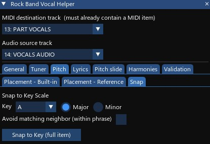

**Snap to Key Scale** shifts every vocal note in scope to the nearest pitch in a chosen key, moving each note by the fewest semitones needed to land on a scale degree. On a tie (a note equidistant between two scale degrees), the lower pitch wins.

Set the **Key** (root note) and **Scale** (Major or Minor) to match the song — look these up on Tunebat or a chord chart and verify by ear.

**Scope:** with an active time selection, only notes within the selection are snapped. This is useful for songs with key changes or chromatic passages where you want to snap one section at a time. Without a time selection, clicking **Snap to Key (full item)** shows a confirmation dialog before processing the whole MIDI item.

**Avoid matching neighbor (within phrase)** — after snapping, if two adjacent notes within the same phrase land on the same pitch (but had different pitches before snapping), the note that moved more semitones is redirected to the next-closest scale degree instead. Notes on either side of a phrase boundary are not compared — a phrase-ending note and the following phrase-opening note may legitimately share a scale degree.

Phrase markers (pitch 105) are never moved or deleted. Per-note velocity and lyrics are preserved through the operation.

---

## Lyrics tab

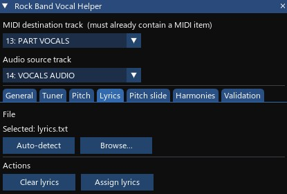

The Lyrics tab assigns words from a plain-text file to the MIDI notes on the destination track as lyric text events (the same format REAPER's native lyric tools use).

> **Note on RB3 conventions:** Lyric assignment operates on notes within the RB3 vocal range (C1–C5, MIDI pitches 36–84), and the phrase capitalization check uses pitch 105 as the phrase-boundary marker. These are Rock Band 3 standards; if you author for a different game with a different convention, the script's behaviour here may need adjusting.

### Lyrics file format

A plain `.txt` file — one word (syllable) per entry, separated by any whitespace (spaces, tabs, or newlines). Anything inside `[square brackets]` is stripped before splitting, so section headers like `[chorus]` are ignored.

```
And I
[verse]
would walk five hun- dred miles
```

### Selecting a file

- **Auto-detect** — looks for `lyrics.txt` in the project folder and selects it automatically. Runs on script open and when you switch REAPER project tabs.
- **Browse...** — opens a file picker starting in the project folder. Only `.txt` files are accepted.

The selected filename is shown above the buttons. The path is remembered for the duration of the session but is not saved to the project file.

### Assigning lyrics

All four buttons sit on one row:

| Button            | What it does                                                                     |
| ----------------- | ---------------------------------------------------------------------------------- |
| **Auto-detect**   | Find `lyrics.txt` in the project folder                                          |
| **Browse...**     | Pick any `.txt` file                                                             |
| **Clear lyrics**  | Remove all lyric events from the whole MIDI take (preserves special game events) |
| **Assign lyrics** | Clear first, then assign one word per note in start-time order                  |

**Assign lyrics** always operates on the whole take regardless of any time selection. Words are read from the start of the file and assigned in order to every note in the RB3 vocal range (C1–C5). Time selection is intentionally ignored — scoping to a selection would assign the first words in the file to whichever notes are in the selection, shifting every subsequent word onto the wrong note.

Special game events (`[tambourine_start]`, `[cowbell_start]`, etc.) are always preserved by both Clear and Assign.

### Result panel

After **Assign lyrics** the result panel shows:

- How many syllables were added and what range was used.
- A **count mismatch warning** if the number of notes and lyrics words differ — e.g. _"48 notes, 45 lyrics — last 3 notes have no lyric"_.
- A **phrase capitalization check**: for each phrase marker note (pitch 105) the script finds the first vocal note that follows it and checks that its assigned lyric starts with an uppercase letter. Violations are listed with their measure number and timestamp so you can jump straight to the problem:

  ```
  Phrase capitalization: 2 violation(s):
    m32  1m 04.250s  "and"
    m67  2m 14.120s  "it"
  ```

  If no phrase marker notes are present the check reports that it cannot validate.

> **Tip:** Place phrase markers on your destination MIDI track before running Assign lyrics. The script reads them but never modifies them, so they are safe to have in place throughout the whole authoring process.

---

## Pitch slide tab

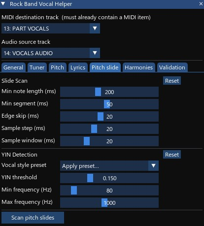

The **Pitch slide** tab scans existing MIDI notes on the destination track and reports any where the detected pitch moves significantly during the note — slides, scoops, bends, and other pitch curves that a Rock Band vocal chart may need to represent explicitly.

> **This action is read-only.** It never modifies notes; it only reports findings.

### How to use it

1. Generate notes onto the destination track first.
2. (Optional) Make a time selection to limit the scan.
3. Click **Scan pitch slides**.

If no time selection is active, a confirmation dialog appears before scanning the whole song.

The result panel lists every note where a slide was detected, with its position, length, pitch, and movement type (Slide up, Slide down, Scoop, Bend, or Complex). Use the measure numbers to jump directly to each note in REAPER.

### Slide Scan settings

| Slider              | Range       | Default | What it does                                                                                       |
| ------------------- | ----------- | ------- | ----------------------------------------------------------------------------------------------------- |
| **Min note length** | 20 – 300 ms | 80 ms   | Notes shorter than this are skipped entirely.                                                      |
| **Min segment**     | 5 – 100 ms  | 20 ms   | A detected pitch run shorter than this is discarded. Increase to suppress false positives.         |
| **Edge skip**       | 0 – 50 ms   | 20 ms   | Skip the start and end of each note before sampling. Hides consonant artifacts at note boundaries. |
| **Sample step**     | 5 – 50 ms   | 10 ms   | How often pitch is sampled along the note. Smaller = more resolution but slower.                   |
| **Sample window**   | 10 – 50 ms  | 20 ms   | YIN analysis window per sample point. Longer = more stable detection.                              |

The scan also uses the **YIN threshold**, **Min frequency**, and **Max frequency** settings from the Pitch tab.

---

## Harmonies tab

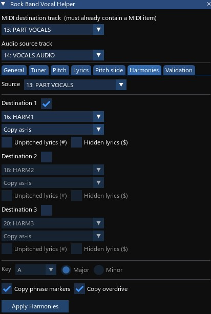

The **Harmonies** tab copies lead vocal notes from a source MIDI track to up to three destination tracks, transposing each by a chosen pitch interval. Lyrics from the source are copied at the same time. Use this to build Rock Band-style harmony parts (HARM1, HARM2, HARM3) from a completed lead vocal (PART VOCALS) without manual copy-and-paste.

It also handles the reverse case: once the harmony parts are authored, the [Preserve target pitches](#preserve-target-pitches) copy style pushes later timing fixes from the lead down to them without overwriting the pitches you picked.

### Setting up tracks

The script auto-selects tracks by name on startup and on project switch:

| Role          | Auto-selected track name                                     |
| ------------- | -------------------------------------------------------------- |
| Source        | `PART VOCALS` (first MIDI item found); falls back to `HARM1` |
| Destination 1 | `HARM1`                                                        |
| Destination 2 | `HARM2`                                                        |
| Destination 3 | `HARM3`                                                        |

All four dropdowns can be changed manually. Destination tracks do not need to contain a MIDI item — the script will report an error if one is missing when you click Apply.

### Destination rows

Each destination row (Destination 1, 2, 3) has three controls:

- **Enabled checkbox** — enable or disable that destination. Disabled rows are greyed out. At least one destination must be enabled to apply.
- **Target track** — the MIDI track to write harmony notes into.
- **Copy style** — how copied notes are pitched (see [Copy styles](#copy-styles) below).

Below the Copy style dropdown, two per-destination checkboxes control lyric suffixes:

| Checkbox                 | Suffix added | Effect in Rock Band                                                                                                                                                                            |
| ------------------------ | ------------ | ---------------------------------------------------------------------------------------------------------------------------------------------------------------------------------------------- |
| **Unpitched lyrics (#)** | `#`          | The game accepts any pitch for that syllable. Use for screamed or growled harmonies where exact pitch is not expected.                                                                         |
| **Hidden lyrics ($)**    | `$`          | The lyric is invisible on screen. Rock Band displays two distinct lyric lines at once; hide the duplicate track's lyrics so the second display slot is free for a track with different lyrics. |

If a source lyric already ends with `#` or `$`, the suffix is not duplicated. When both checkboxes are on, `#` is appended before `$`.

### Copy styles

| Copy style            | Semitone offset | Notes                                                                                  |
| ---------------------- | --------------- | ------------------------------------------------------------------------------------ |
| Copy as-is            | 0               | Exact copy at the same pitch.                                                          |
| Fixed minor 3rd above | +3              | Same offset applied to every note.                                                     |
| Fixed major 3rd above | +4              | Same offset applied to every note.                                                     |
| Fixed minor 3rd below | −3              | Same offset applied to every note.                                                     |
| Fixed major 3rd below | −4              | Same offset applied to every note.                                                     |
| Diatonic 3rd above    | varies          | Interval depends on the scale degree — +3 or +4 st per note. Requires a Key selection. |
| Diatonic 3rd below    | varies          | Same as above, downward. Requires a Key selection.                                     |
| Fixed 4th above       | +5              | Will not fit most songs without clipping the vocal range.                              |
| Fixed 5th above       | +7              | Will not fit most songs without clipping the vocal range.                              |
| Fixed 4th below       | −5              | Will not fit most songs without clipping the vocal range.                              |
| Fixed 5th below       | −7              | Will not fit most songs without clipping the vocal range.                              |
| Preserve target pitches | none          | Pitch comes from the target track instead of the source. See below.                     |

Before writing any MIDI, the script checks that every transposed note would land within the RB3 vocal range (C1–C5). If any note would go out of range the action is aborted with a clear error identifying the note and destination — no MIDI is modified.

### Preserve target pitches

Once you have authored a harmony part by hand, its pitches follow the actual recording and no longer match any interval preset. If you later fix the lead — split a note for a slide, nudge a start, trim a length — re-applying an interval preset would push those timing changes down but throw away every pitch you picked.

**Preserve target pitches** copies the source's positions, lengths, splits and lyrics exactly as the other styles do, but takes each note's pitch from whatever was already on the target track. Notes whose pitch has not changed get rewritten with the same pitch, so the two tracks end up back in sync on timing without you losing any tuning work.

Each copied note gets its pitch from one of four rules, and the result panel counts how many notes landed in each:

| Result line                              | Rule                                                                                                                                                 |
| ---------------------------------------- | ---------------------------------------------------------------------------------------------------------------------------------------------------- |
| **Existing pitches applied**             | The note overlaps a note already on the target track, and takes its pitch. Where several overlap, the one sharing the most time wins.                 |
| **Matching closest pitch applied**       | Nothing overlaps — the note moved far enough to clear its old position. The nearest target note starting within one measure donates its pitch.        |
| **Slide interval carried**               | The note shares a donor with the note before it, which is what a note split in two for a slide looks like. The first half keeps the target pitch; each later half gets that pitch plus the source's own interval, so the slide's direction and size survive. |
| **No matching close pitch source applied** | Nothing on the target track within a measure — a genuinely new note. The source pitch is copied unchanged, with no interval applied, so it stands out for retuning by hand. |

The Key section stays greyed out for this style — no scale is involved. If a carried slide interval would push a note outside C1–C5, the action aborts before writing anything, the same as an out-of-range interval preset.

### Key section

The **Key** controls are active only when at least one destination uses a Diatonic mode. Pick the root note and quality (Major or Minor) that match the song.

**Detecting the key from MIDI:** Click **Detect from MIDI** to analyse the pitch histogram of the source MIDI item using the Krumhansl-Schmuckler algorithm. The result (most likely key + confidence percentage + runner-up) appears below the buttons. The key selector is not changed automatically — verify the suggestion, then set it manually.

**Detecting the key from audio:** Click **Detect from audio** to run YIN pitch detection at 100 ms intervals across the full audio item (the track selected on the General tab), build a pitch histogram from those readings, and report the most likely key. Uses the same YIN settings as the Pitch tab. May take a few seconds on long tracks.

Neither detect button changes the key selector — they only display a suggestion.

### Copy phrase markers / overdrive

Two independent checkboxes copy notes outside the vocal pitch range (C1–C5) from the source to each enabled destination: **Copy phrase markers** (pitch 105) and **Copy overdrive** (pitch 116). Each clears only its own matching notes in the destination within the scope before inserting.

### Scope and applying

If a time selection is active, only notes that start within it are processed. Without a time selection, clicking **Apply Harmonies** shows a confirmation dialog before proceeding.

Click **Apply Harmonies** to write the notes. The action:

1. Clears all vocal-range notes from each enabled destination within the scope.
2. Clears all lyric text events from each destination within the scope (preserving special game events such as `[tambourine_start]`).
3. If **Copy phrase markers** is on, also clears out-of-range notes from each destination within the scope.
4. Inserts the transposed notes, phrase notes, and lyrics into each destination.

The whole operation is a single undo entry — Ctrl+Z or the **Undo** button at the bottom of the window will revert all destinations at once.

The result panel reports per-destination counts:

```
Destination 1 [Diatonic 3rd above]: cleared 42 notes / 38 lyrics, inserted 42 vocal + 6 phrase (38 lyrics)
```

---

## Validation tab

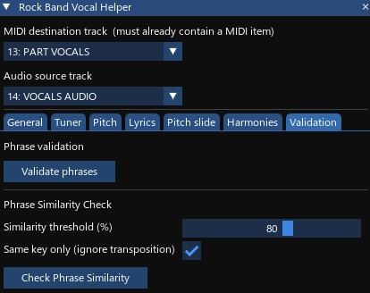

### Validate phrases

Checks all phrases (regions bounded by pitch-105 marker notes) for common authoring issues. Reports per phrase:

1. First vocal note has a capitalized lyric
2. Phrase marker start is on a 64th-note grid boundary
3. Phrase marker end is on a 64th-note grid boundary
4. Gap to the next phrase is at least 4 × 64th note
5. First vocal note starts at least 2 × 64th notes after phrase start
6. Last vocal note ends at least 1 × 64th note before phrase end

Operates on the whole take regardless of time selection. Read-only — does not modify the project.

### Phrase Similarity Check

Compares all phrases by their melodic content and groups those that are similar enough to be the same melody. Use this to catch copy errors in repeated sections — for example, a verse used twice where one note was accidentally changed in the second occurrence, or an intentional variation you want to compare against the other occurrences.

| Setting                  | Description                                                                                                                                                                                                                                                     |
| ------------------------ | ------------------------------------------------------------------------------------------------------------------------------------------------------------------------------------------------------------------------------------------------------------- |
| **Similarity threshold** | Minimum similarity (50–100%) for two phrases to be grouped. 80% is a reasonable starting point. Lower it to catch more distant matches; raise it to focus on near-identical copies.                                                                             |
| **Same key only**        | When on (default), compares actual note pitches — phrases must be note-for-note the same to score high. When off, compares melodic contour (the shape of rises and falls) regardless of transposition, so the same melody in a different key still scores high. |

Click **Check Phrase Similarity** to run the analysis. The result panel shows each group of similar phrases with their minimum pairwise similarity, and flags any notes that differ from the group consensus:

```
Compared 12 phrases at 80% threshold — same key (pitch).

Group 1: 3 phrases (92% min similarity)
  m4   C4 D4 E4 F4 G4
  m12  C4 D4 E4 F4 G4
  m20  C4 D4 E4 G4 G4  <- outlier: note 4: F4→G4 (+2 st)

Group 2: 2 phrases (100% min similarity) — no outliers
  m8
  m16
```

Phrases with no outliers show a one-line summary. Only notes that differ from the group's majority-vote consensus are flagged, along with the deviation in semitones. The check is read-only — you decide whether each flagged difference is a mistake or an intentional variation.

The check requires at least two phrase markers on the MIDI track and at least two notes per phrase to produce a comparison. Phrases with fewer than two notes are skipped.

---

## Undo

The **Undo** button sits in the status bar at the bottom of the window, always visible regardless of which tab is active. It directly calls REAPER's undo and exists because the ImGui window captures keyboard focus, so REAPER's own Ctrl+Z shortcut does not fire while the script window is active. The button is disabled when there is nothing to undo, and the tooltip shows the label of the operation that will be undone.

---

## Tips

- **Use a time selection to work section by section.** Chorus and verse may need different pitch or scan settings — most actions on Pitch, Pitch slide, and Harmonies scope to the active selection.
- **Finish timing and pitch before assigning lyrics.** Assign lyrics runs on notes as they are at the moment you click — if you later split, merge, or reorder notes, re-run Assign lyrics to realign the words. The whole-take clear-and-reassign approach keeps this safe and idempotent.
- **Name your lyrics file `lyrics.txt` and save it in the project folder.** Auto-detect will find it every time you open the script or switch project tabs, saving you the Browse step entirely.

More tips specific to note detection/generation (Note Placement) are in [README_WIP.md](README_WIP.md#tips).

---

## Troubleshooting

If something is going wrong, find the symptom below and try the suggested fixes.

### Pitch

**YIN reports lots of octave errors.**
Tighten the **Min frequency** and **Max frequency** range to bracket the actual vocal range as closely as possible. As a fallback, enable the **Pitch range constraints** (min/max) — the script will octave-shift out-of-range pitches back in.

**YIN falls back to Default pitch on most notes.**
Raise the **YIN threshold** (try 0.2 or 0.25). The threshold is a confidence cutoff — too strict and the algorithm rejects valid detections.

**YIN auto-tune isn't improving results, or the result is still wrong on many notes.**
YIN auto-tune is a best-estimate search, not a guarantee. Even with perfectly corrected reference notes, pitch detection accuracy is ultimately bounded by the audio itself — stem separation artifacts, noise, or vocal characteristics like heavy vibrato or breathy tone can make some pitches genuinely ambiguous regardless of settings. Treat the result as a better starting point, not a final answer: accept the updated sliders, then use pitch range constraints or **Apply pitch changes** after manual corrections to clean up remaining errors. If the results are consistently poor, also check that the reference notes span a range of pitches in the selection — a reference that is all one note gives the search little gradient to work with.

**Reference MIDI mode reports zero matches.**
Check that the reference MIDI item actually overlaps the analysis range, and that the **Search tolerance** is wide enough (try 200–500 ms). If your reference is consistently early or late versus the audio, nudge the MIDI item in REAPER to align it.

### Lyrics

**Lyrics file isn't auto-detected.**
The auto-detect looks for a file literally named `lyrics.txt` in the project folder. Check the filename (extension included) and the folder, or use **Browse...** to pick the file manually.

**Count mismatch warning: more notes than lyrics.**
The lyrics file has fewer syllables than there are notes in scope. Common causes: a multi-syllable word that should be split with hyphens (`won-` `der-` `ful` instead of `wonderful`), or an extra note that shouldn't be there.

**Count mismatch warning: more lyrics than notes.**
The opposite — usually a missed detection (try a lower RMS threshold on the Note Placement tab) or two syllables incorrectly merged into one note (try peak-split).

**Phrase capitalization check reports violations.**
A phrase marker note (pitch 105) is followed by a lyric that starts with a lowercase letter. Either capitalize the lyric in your file or move the phrase marker — the result panel gives you the measure number and timestamp so you can navigate directly.

Detection-specific troubleshooting (consonants vs. vowels, missed/false notes, auto-tune) is in [README_WIP.md](README_WIP.md#troubleshooting).

---

## Quick actions

`quick_actions/` contains four small scripts, separate from the main window, meant to be bound to hotkeys for fast note editing while a MIDI editor is open on a vocal-range take. Load each one individually (**Actions → Show action list → Load ReaScript**, or **New action... → Load ReaScript...**) and assign a keyboard shortcut. Each one no-ops silently (no undo point created) if no MIDI editor is open or no qualifying note is found, so they're safe to bind and press speculatively.

| Script | What it does |
| --- | --- |
| **Vocal note snap to playhead (auto)** | Finds the vocal-range note (C1–C5) at the edit cursor, or the nearest one within 1s, selects it, and snaps whichever edge is closer to the cursor — start closer moves the note (length preserved), end closer stretches it. |
| **Vocal note snap start to playhead** | Same note-finding, always moves the note to start at the cursor (length preserved). |
| **Vocal note snap end to playhead** | Same note-finding, always stretches the note to end at the cursor. Ignores notes starting at or after the cursor. |
| **Vocal note create at playhead** | Creates a new note at the cursor, one MIDI-editor grid unit long, pitch copied from the nearest vocal-range note (or C3 if none exists). Clamped so it never overlaps the next note; does nothing if the cursor is inside an existing note. |

---

## Known limitations

These are intentional trade-offs or REAPER API constraints, not bugs. Documented here so you know what to expect.

1. **Apply pitch changes matches by note-start time only.** If you have manually shifted notes around significantly, a moved note will pull the pitch of whatever reference note is closest in time, which may not be the one you intended. Re-run timing detection if matching breaks down.

2. **Single audio item per audio track.** Without a time selection, only the first item on the audio track is analyzed. With a time selection, the script picks the item that overlaps. If your stem is split across multiple items, glue them first. Applies to Note Placement's detection, the Tuner, and Harmonies' Detect from audio.

3. **Reference MIDI alignment is the user's responsibility.** There is no automatic cross-correlation between detected onsets and reference onsets. If Basic Pitch's output is consistently early or late, nudge the MIDI item in REAPER or widen the Search tolerance.

4. **Track selections are not persisted across sessions.** Track indices are positional and would be brittle to save. Smart defaults (matching `VOCALS AUDIO` / `PART VOCALS` track names) cover the common case; otherwise re-pick on each open.

5. **Harmony copy style indices are positional.** The copy style for each destination is saved as an index into the style list. New styles are appended to the end of the list so existing saves keep their meaning, but if the order ever changes between script versions, saved styles may map to different intervals. Check destination copy styles after a script update.

6. **YIN samples a fixed window at 30% into the note.** Works well for sustained vowels but may land on a consonant for very fast syllables. The 30% offset is a heuristic that avoids the attack transient while staying inside the note.

For limitations specific to note detection/generation (Note Placement), see [README_WIP.md](README_WIP.md#known-limitations).
