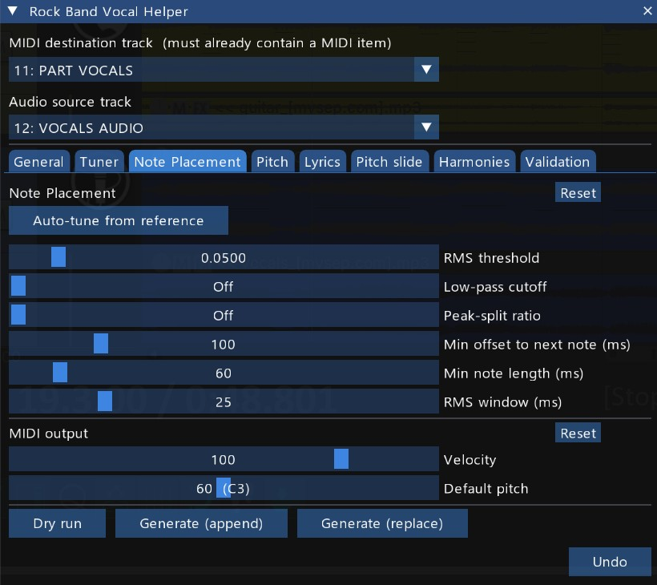

# Rock Band Vocal Helper — Work-in-progress tabs

← [Back to main README](README.md)

This tab is enabled via **General → Settings → Show WIPs? = Yes**. It works at a basic level but has known issues and isn't ready for general use — expect rough edges. Notably, this is currently the *only* path to automatic note detection/generation in the script; everything else (Pitch, Lyrics, Pitch slide, Harmonies, Validation) operates on notes that already exist on the destination track, however they got there.

---

## Note Placement tab

Contains two sub-tabs: **Auto Detection** and **Draft Snap**.

### Auto Detection sub-tab

#### Detection settings

The Detection sliders control the audio energy analysis. Start with defaults and adjust based on what Dry run reports.

| Slider                      | Range                 | Default | What to adjust                                                                                                         |
| ---------------------------- | --------------------- | ------- | ------------------------------------------------------------------------------------------------------------------------ |
| **RMS threshold**           | 0.001 – 0.5           | 0.05    | Lower if quiet phrases are missed; raise if noise/breath triggers too many notes.                                      |
| **Low-pass cutoff**         | 0 – 8000 Hz (0 = off) | Off     | Set to ~1500–2500 Hz to make sibilants (S, F, SH) invisible to the detector, so note starts snap to the vowel.         |
| **Peak-split ratio**        | 0 – 95% (0 = off)     | Off     | When phrases contain multiple syllables without dropping to silence, this splits them. Start around 40–60% and adjust. |
| **Min offset to next note** | 0 – 500 ms            | 100 ms  | Enforces a minimum gap between notes by trimming end times. Prevents notes from running into each other.               |
| **Min note length**         | 10 – 500 ms           | 60 ms   | Discards very short detections (breath noise, consonants). Raise to filter out more.                                   |
| **RMS window**              | 5 – 100 ms            | 25 ms   | Time resolution of the analysis. Smaller = more precise timing but slower. Rarely needs changing.                      |

**Snap to onsets** — checkbox; when enabled, a **Snap window (ms)** slider (10–200 ms) appears, pulling detected note boundaries onto the nearest audio onset within that tolerance.

> **Tip:** All sliders support Ctrl+click to type an exact value.

#### MIDI output

- **Velocity** — MIDI velocity assigned to every generated note (1–127).
- **Default pitch** — the fixed pitch used by Generate and Dry run for every note. Also serves as the fallback when Reference MIDI or Built-in detection cannot assign a pitch to a note. Displayed using Rock Band octave numbering (C1 = MIDI 36, C5 = MIDI 84).

#### Generating notes

- **Dry run** — runs the full detection pipeline but does not write anything to REAPER. Reports how many notes were found and other stats.
- **Generate (append)** — writes notes into the destination MIDI item. Before inserting, it clears existing notes at the pitches it will produce (plus the Default pitch) within the analysis range, so re-running is safe and does not stack duplicates.
- **Generate (replace)** — clears _all_ notes in the vocal pitch range (C1–C5) within the analysis range first, then inserts the new notes. Notes at other pitches (phrase markers at pitch 105, etc.) are preserved. Use this when you want a completely fresh result with no leftover notes from previous runs.

The result panel below the tab bar shows counts for the last action.

### Draft Snap sub-tab

<!-- TODO: screenshot of the Draft Snap sub-tab -->

Draw rough notes by hand on the destination MIDI track — right note count, approximate timing — then click **Snap draft notes** to lock each note's boundaries onto the audio's actual onsets within the **Snap window (ms)** slider (10–300 ms) tolerance.

---

## Auto-tune from reference

Auto-tune automates the process of finding Detection slider values that reproduce a set of manually-placed timing reference notes.

**How to use it:**

1. Manually place a handful of MIDI notes on the destination track at the Default pitch. These represent the "correct" timing you want the detector to match.
2. Make a time selection covering those reference notes.
3. Click **Auto-tune from reference**.

The script runs a coordinate descent search over five detection parameters (**RMS threshold**, **Low-pass cutoff**, **Peak-split ratio**, **Min offset**, **Min note length**) and leaves the rest alone. When it finishes, the sliders update to the best-found values and the result panel shows accuracy statistics.

**What auto-tune changes:** the five detection sliders listed above.
**What it leaves alone:** RMS window (a resolution choice, not a fit-to-reference parameter), all pitch settings, velocity, and your reference notes themselves.

> **Note:** Auto-tune can take several seconds for longer sections. The UI will be unresponsive during the search — this is expected (see [Known limitations](#known-limitations)).

---

## Tips

- **Use Generate (append) for iteration, Generate (replace) for a clean slate.** Append mode re-runs safely without stacking duplicates (clears only the pitches it's about to write). Replace mode wipes all vocal-range notes in the range — useful when detection settings have changed significantly and you want a completely fresh result.
- **Use a time selection to work section by section.** Chorus and verse may need different threshold settings. Generate into the same MIDI item repeatedly; each run only touches its own range.
- **Low-pass cutoff makes a big difference** for sibilant-heavy vocals. If note starts consistently land on the consonant instead of the vowel, enable the low-pass filter around 1500–2000 Hz.
- **Reference MIDI mode + Basic Pitch is a good combination:** Basic Pitch provides reasonable pitch estimates that you can refine with the pitch range constraints on the Pitch tab, while this tab's detection provides tighter timing than Basic Pitch alone.
- **Auto-tune works best with 10–30 representative reference notes** covering the range of dynamics in the section.

---

## Troubleshooting

**Note starts land on consonants instead of vowels.**
Enable the **Low-pass cutoff** at around 1500–2000 Hz. Sibilants (S, F, SH) carry significant energy at high frequencies, which can trigger detection slightly before the vowel begins. Filtering them out makes the detector "see" the vowel onset.

**Quiet phrases are being missed entirely.**
Lower the **RMS threshold** (try 0.02 or 0.01). If only specific phrases are quiet relative to the rest of the section, work that section separately with a time selection.

**Too many false notes — breath noise, consonants, room tone trigger detections.**
Raise the **RMS threshold**, raise **Min note length** to 80–120 ms, or both. Breath noise is usually short and low-energy; either of these filters should remove most of it.

**Fast syllables are being merged into one long note.**
Enable **Peak-split ratio**. Start at 40–50% and adjust. The split happens wherever the contour drops below `peak × ratio` within a phrase.

**Notes are running into each other with no gap between them.**
Raise **Min offset to next note**. The default of 100 ms is conservative; values up to 200–250 ms work well for slower vocals.

**Auto-tune produces strange results, or results aren't noticeably better than defaults.**
Auto-tune is a heuristic search — it finds the best combination from a set of candidate values, but there is no guarantee that combination will be perfect for every vocal. Even with accurate reference notes, the underlying audio (stem separation quality, room noise, breathy or sibilant vocals) constrains how well any parameter set can perform. Treat the result as a starting point: accept the values, then nudge the sliders manually from there. If the result is consistently poor, check that the reference notes cover the dynamic range of the section and that 10–30 reference notes are used rather than just a few.

---

## Known limitations

1. **Auto-tune freezes the UI during the parameter search.** Single-threaded Lua, and REAPER's audio accessor APIs (`GetAudioAccessorSamples`, `new_array`) do not work reliably from a Lua coroutine — they return nil. A coroutine-based progress bar was attempted and reverted for this reason. Typical 20–40 second sections finish in a few seconds; full songs can take noticeably longer.

2. **Peak-split uses the global per-phrase peak.** A phrase with one loud syllable (RMS 0.8) and one quiet one (RMS 0.3) at split ratio 50% will lose the quiet syllable, because the cut threshold (0.4) is above it. In practice vocals usually stay within ~2× dynamic range within a phrase, but uneven sections may need a lower split ratio or a manual fix.

See the main README's [Known limitations](README.md#known-limitations) for constraints shared with the stable tabs (single audio item per track, track selections not persisted, etc).
